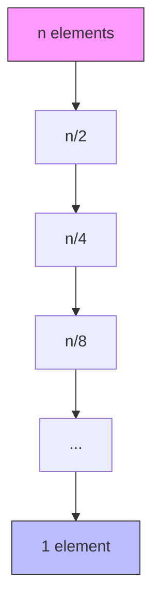

# 🔎 Search Algorithms in Java

> **Search algorithms** answer one question: *"Is this element in my data — and if so, where?"*

Think of searching like **finding a book in a library** 📚. You have two instincts:

- **Scan every shelf** from the entrance — slow, but works no matter how messy the library is. → **Linear Search**
- **Use the catalog** — jump straight to the right aisle, then the right shelf. But this only works if the books are **sorted by title**. → **Binary Search**

The whole chapter boils down to one idea: **the more organized your data, the faster you can search it.**

---

# Part 1 — 📍 Linear Search: The Patient Scanner

## What It Is

> **Idea:** Check elements **one by one**, from the start, until you find the target.

Imagine you're looking for your name on the **class attendance sheet**. You read line 1, line 2, line 3... until you find yourself. You don't skip lines — the sheet isn't sorted by name, so you can't guess where you are.

## The Algorithm (5 simple steps)

1. Start at index `0`.
2. Compare `arr[i]` with the target.
3. **Found?** → return the **index** (or `true`).
4. **Not found?** → move to the next index.
5. **Reached the end?** → return `-1` (or `false`).

## 🧪 Watch It Work — A Frame-by-Frame Trace

Search for `7` in `[5, 2, 9, 7, 1]`:

```
Index:   0    1    2    3    4
Array: [ 5,   2,   9,   7,   1 ]

Step 1:  compare arr[0]=5  vs 7  → 5 ≠ 7 → move on
Step 2:  compare arr[1]=2  vs 7  → 2 ≠ 7 → move on
Step 3:  compare arr[2]=9  vs 7  → 9 ≠ 7 → move on
Step 4:  compare arr[3]=7  vs 7  → 7 == 7 → ✅ RETURN 3
```

It took **4 comparisons** to find `7`. If we'd searched for `1`, it would take **5**. If we'd searched for `99` (not in the list), it would check **all 5** and then give up.

> 💡 Notice: linear search **never "knows" where the target is** — it must look at every candidate until it's sure.

## The Code

```java
static int linearSearch(int[] arr, int target) {
    if (arr.length == 0) return -1;               // empty? nothing to find

    for (int index = 0; index < arr.length; index++) {
        if (arr[index] == target) {
            return index;                          // ✅ found → its position
        }
    }
    return -1;                                     // ❌ never found
}
```

### 🧩 Same Idea, Different Flavors

Linear search is a **template** — you can bend it to many jobs:

| Job | What changes | Code shape |
|-----|--------------|------------|
| Search a **String** | Loop `str.charAt(i)` instead of array | `for (i < str.length())` |
| Search **in a range** | Loop from `start` to `end` only | `for (i = start; i <= end)` |
| Find **min/max** | Track the best value, not an index | `best = Math.min(best, arr[i])` |
| Return **true/false** | Return `true` on match | `return true;` then `return false;` |

```java
// Example: search only indices [start, end]
static int linearSearchInRange(int[] arr, int target, int start, int end) {
    for (int index = start; index <= end; index++) {
        if (arr[index] == target) return index;
    }
    return -1;
}
```

## ⏱️ Time Complexity

| Case | Time | When does it happen? |
|------|------|----------------------|
| **Best** | **O(1)** | Target is the **first** element — 1 comparison |
| **Worst** | **O(n)** | Target is **last**, or **absent** — every element checked |
| **Space** | **O(1)** | No extra memory — just a loop counter |

> 🦸 **Linear search's superpower:** it works on **anything** — unsorted data, jagged arrays, strings. No prerequisites, no setup. For tiny data, it's often the *best* choice because it has zero overhead.

[Refer Code](LinerSearch.java)

---

# Part 2 — 🔢 Search in a 2D Array

## What It Is

> **Idea:** A 2D version of linear search — scan every row, and within each row, every column.

Think of a **ticket booth grid** 🎫: Row 1 has 4 seats, Row 2 has 4 seats, Row 3 has 5 seats. To find seat `111`, you check each row, each seat, in order.

## 🧪 Watch It Work — Searching `111` in a *jagged* matrix

```
Row 0:  [1,   20,  35,  4]
Row 1:  [5,   65,  7,   82]
Row 2:  [95,  10,  111, 12, 16]   ← found here!
                 ^^^
        return {row: 2, col: 2}  → {2, 2}
```

Notice Row 2 has **5 columns** while rows 0–1 have **4**. That's a **jagged array** — and our code handles it naturally by asking each row for its *own* length.

## The Code

```java
static int[] search(int[][] arr, int target) {
    if (arr == null || arr.length == 0) return new int[]{-1, -1};

    for (int row = 0; row < arr.length; row++) {        // for each row
        for (int col = 0; col < arr[row].length; col++) { // for each column in that row
            if (arr[row][col] == target) {
                return new int[]{row, col};              // ✅ found → [row, col]
            }
        }
    }
    return new int[]{-1, -1};                            // ❌ not found
}
```

> ⚠️ **Two little traps hiding here:**
> - The inner loop uses `arr[row].length` — **not** `arr.length`. For jagged arrays, mixing these up causes `ArrayIndexOutOfBoundsException`.
> - Always **null/empty check** first — `arr == null` crashes instantly otherwise.

## ⏱️ Complexity

- **Time:** O(m × n) — worst case visits every cell (m rows × n columns)
- **Space:** O(1)

[Refer Code](Search2DArray.java)

---

# Part 3 — ⚡ Binary Search: The Smart Halver

## What It Is

> **Idea:** Repeatedly **cut the search space in half** by comparing the middle element.  
> **Requirement:** The array **must be sorted**.

Think of **finding a word in a dictionary** 📖. You never scan page by page. You open the middle, see your word is *later* in the alphabet, so you rip out the first half mentally and open the middle of what's left. Each open page **eliminates half the book**.

## 🔢 A Sneak Peek: Why Halving is Magic

| Elements | Max steps (linear) | Max steps (binary) |
|----------|--------------------|--------------------|
| 10 | 10 | 4 |
| 1,000 | 1,000 | 10 |
| 1,000,000 | 1,000,000 | 20 |
| 1,000,000,000 | 1,000,000,000 | **30** |

> 🚀 That's the whole point of binary search: **1 billion elements, 30 comparisons.** Linear would need a billion.

## The Algorithm (4 steps)

1. Set `low = 0`, `high = length - 1`. (The "search window.")
2. Find the middle: `mid = low + (high - low) / 2`.
3. Compare `arr[mid]` with the target:
   - **Equal** → return `mid` ✅
   - **Target > mid** → target lives to the **right** → `low = mid + 1`
   - **Target < mid** → target lives to the **left** → `high = mid - 1`
4. Repeat **while `low <= high`**. If the window closes (`low > high`) → target absent → `-1`.

## 🧪 Watch It Work — Tracking Every State

Search for `36` in `[-24, 12, 18, 24, 36, 45, 59]`:

```
Index:    0    1    2    3    4    5    6
Array:  [-24,  12,  18,  24,  36,  45,  59]
                          ▲
        low=0            mid=3            high=6
        arr[3] = 24   →   36 > 24  →  search RIGHT
        low becomes 4                     (window: [4..6])

Index:    0    1    2    3    4    5    6
Array:  [-24,  12,  18,  24,  36,  45,  59]
                                   ▲
                          low=4   mid=5   high=6
        arr[5] = 45   →   36 < 45  →  search LEFT
        high becomes 4                     (window: [4..4])

Index:    0    1    2    3    4    5    6
Array:  [-24,  12,  18,  24,  36,  45,  59]
                                   ▲
                          low=4   mid=4   high=4
        arr[4] = 36   →   36 == 36  →  ✅ RETURN 4
```

**Only 3 comparisons** — and notice how the window `[low, high]` **shrank from 7 elements to 3 to 1**. Every step, the space halves. That shrinking window *is* binary search.

## The Code

```java
static int binarySearch(int[] arr, int target) {
    if (arr.length == 0) return -1;

    int low = 0;
    int high = arr.length - 1;

    while (low <= high) {                                // window still open?
        int mid = low + (high - low) / 2;                // overflow-safe middle

        if (target == arr[mid]) return mid;              // ✅ jackpot
        else if (target > arr[mid]) low = mid + 1;       // go right
        else high = mid - 1;                             // go left
    }
    return -1;                                           // window closed → not found
}
```

## 🚨 Why `low + (high - low) / 2` and Not `(low + high) / 2`?

This is a **classic interview trap**:

```java
low + high            // ❌ can OVERFLOW for giant arrays (max int ≈ 2.1 billion)
low + (high - low)/2  // ✅ always safe — the difference can never overflow
```

If your array has ~2 billion elements, `low + high` silently wraps to a **negative number** → `mid` becomes wrong → infinite loop or garbage results. The safe formula is a one-word change that removes an entire class of bugs.

## 🌟 The Golden Rules of Binary Search

| Rule | Why it saves you |
|------|------------------|
| **Array MUST be sorted** | Unsorted data breaks the "which half?" logic |
| **Use `while (low <= high)`** | `<` misses the case `low == high` (single-element search) |
| **Always move `mid ± 1`** | `low = mid` (without +1) can loop forever |
| **Use the safe mid formula** | Prevents integer overflow |
| **Empty check first** | `arr.length == 0` returns `-1` immediately |

> 🧠 **Mental model:** binary search is a **window** `[low, high]` that keeps closing. As long as the window has at least one element (`low <= high`), keep peeking at the middle. When the window collapses to nothing, the target was never there.

## ⏱️ Time Complexity

| Case | Time | When? |
|------|------|-------|
| **Best** | **O(1)** | Target is the middle on the first try |
| **Worst** | **O(log n)** | Halving until 1 element remains |
| **Space** | **O(1)** | Iterative — no extra memory |



[Refer Code](BinarySearch.java)

---

# Part 4 — ⚡⚡ Order-Agnostic Binary Search

## The Problem

What if the array is sorted — but you don't know **which direction**? Ascending? Descending?

```
[1, 3, 5, 7, 9]    ← ascending (go right when target is bigger)
[9, 7, 5, 3, 1]    ← descending (go RIGHT when target is smaller!)
```

Using ascending logic on a descending array → your "go right" instinct is exactly backwards.

## The Fix: Detect Direction First

```java
static int orderAgnosticBinarySearch(int[] arr, int target) {
    if (arr.length == 0) return -1;

    int low = 0, high = arr.length - 1;
    boolean isAsc = arr[low] < arr[high];      // ✅ direction detected in ONE line

    while (low <= high) {
        int mid = low + (high - low) / 2;

        if (target == arr[mid]) return mid;

        if (isAsc) {                            // ascending: normal logic
            if (target > arr[mid]) low = mid + 1;
            else high = mid - 1;
        } else {                                // descending: flip the directions!
            if (target > arr[mid]) high = mid - 1;
            else low = mid + 1;
        }
    }
    return -1;
}
```

> 💡 **The trick:** compare the **first** and **last** elements. If `arr[first] < arr[last]` → ascending. If `arr[first] > arr[last]` → descending. (Works for arrays of size ≥ 2.)

[Refer Code](BinarySearch.java)

---

# Part 5 — 🔢 Binary Search in a Sorted Matrix (Staircase Search)

## What It Is

> **Idea:** Start at the **top-right corner** and "walk" toward the target — **down** when too small, **left** when too big.

**Works when:** rows *and* columns are each sorted independently.

```
[10, 20, 30, 40]
[15, 25, 35, 45]
[28, 29, 37, 49]
[33, 34, 38, 50]
```

Every row increases → and every column increases ↓. That structure gives you a powerful fact about the **top-right corner**: everything *below* it is bigger, everything *to its left* is smaller. So you can navigate like a game 🎮.

## 🧪 Watch It Work — Finding `29`

```
Start at (0,3) = 40 → target 29 < 40 → too big → go LEFT
        (0,2) = 30 → target 29 < 30 → too big → go LEFT
        (0,1) = 20 → target 29 > 20 → too small → go DOWN
        (1,1) = 25 → target 29 > 25 → too small → go DOWN
        (2,1) = 29 → target 29 == 29 → ✅ FOUND at {2, 1}
```

The path traces a **staircase** 🪜 — 5 moves to find `29` in a 16-cell grid, never revisiting a cell.

## The Code

```java
static int[] search(int[][] arr, int target) {
    int row = 0;
    int col = arr.length - 1;              // start: top-right corner

    while (row < arr.length && col >= 0) { // still inside the grid?
        if (arr[row][col] == target) return new int[]{row, col};

        if (arr[row][col] < target) row++; // too small → go DOWN
        else col--;                        // too big → go LEFT
    }
    return new int[]{-1, -1};
}
```

## ⏱️ Complexity

- **Time:** O(m + n) — at most `rows + cols` moves (each move removes one row *or* one column)
- **Space:** O(1)

> 💡 Elegant, isn't it? No `log` needed — you're just **stair-stepping** to the answer.

[Refer Code](RowColSortedMatrix.java)

---

# 📊 All Five — Side by Side

| Algorithm | Data Requirement | Best | Worst | Space | Returns |
|-----------|------------------|------|-------|-------|---------|
| **Linear (1D)** | None | O(1) | **O(n)** | O(1) | index or -1 |
| **Linear (2D)** | None | O(1) | **O(m·n)** | O(1) | `[row,col]` or `[-1,-1]` |
| **Binary (sorted)** | Sorted | O(1) | **O(log n)** | O(1) | index or -1 |
| **Order-agnostic** | Sorted (any direction) | O(1) | **O(log n)** | O(1) | index or -1 |
| **Staircase (matrix)** | Rows & cols sorted | O(1) | **O(m+n)** | O(1) | `[row,col]` or `[-1,-1]` |

---

# ⚠️ Common Mistakes (Read Before You Code!)

### 1. Binary search on an unsorted array — the #1 bug

```java
int[] arr = {5, 2, 9, 1, 7};      // ❌ NOT sorted!
binarySearch(arr, 9);             // may return -1 even though 9 exists!

Arrays.sort(arr);                 // ✅ sort first
binarySearch(arr, 9);             // ✅ now it works
```

### 2. Using `(low + high) / 2`

```java
int mid = (low + high) / 2;       // ❌ overflows on huge arrays
int mid = low + (high - low) / 2; // ✅ always safe
```

### 3. Wrong loop condition — `low < high` instead of `low <= high`

```java
while (low < high) { ... }   // ❌ misses the single-element case (low == high)
while (low <= high) { ... }  // ✅ window with 1 element still gets checked
```

### 4. Forgetting the `± 1` when moving pointers

```java
low = mid;    // ❌ can loop forever (window never shrinks!)
low = mid + 1; // ✅ window always shrinks
```

### 5. Confusing the return contract

```java
return true;  // ❌ if the caller expects an index!
return index; // ✅ decide: index? boolean? value? Stick to it.
```

### 6. Skipping the empty/null guard

```java
arr.length == 0   // ❌ array empty → crash on arr[0]
arr == null       // ❌ null reference → NullPointerException
```

> ✍️ **Rule of thumb:** guard first, search second. Two lines of protection save hours of debugging.

---

# 📌 When to Use Which?

| Your situation | Reach for |
|----------------|-----------|
| Unsorted array, small data | **Linear Search** |
| Need min/max in one pass anyway | **Linear Search** |
| Sorted array, big data | **Binary Search** |
| Sorted but direction unknown | **Order-Agnostic Binary Search** |
| First/last occurrence, insert position | **Binary Search variants** |
| 2D matrix, rows & cols sorted | **Staircase Search** |
| Unsorted 2D matrix | **2D Linear Search** |

---

# 🧠 Practice: Think by Hand

**Exercise 1 — Trace it.** Search for `59` in `[-55, -24, 12, 18, 24, 36, 45, 59, 65, 71, 83, 99]` (12 elements). Write down `low`, `high`, `mid` for each step. How many comparisons?

> *Answer hint: it should take 4 steps — far fewer than 12.*

**Exercise 2 — Spot the bug.** This code hangs forever. Why?

```java
int low = 0, high = arr.length - 1;
while (low <= high) {
    int mid = low + (high - low) / 2;
    if (target > arr[mid]) low = mid;      // ← bug hiding here
    else high = mid;
}
```

**Exercise 3 — Design it.** Can you binary-search a **sorted but circular** array (e.g. `[13, 17, 2, 5, 8, 11]`)? Hint: one half is always sorted.

---

# 📝 Quick Revision Cheatsheet

* **Linear Search:** scan one-by-one → Best O(1), Worst O(n), works on *anything*
* **2D Search:** nested loop over rows & cols → returns `[row, col]` or `[-1, -1]`
* **Binary Search:** halve the search space → Best O(1), Worst O(log n), needs **sorted** data
* **Safe mid:** `low + (high - low) / 2`
* **Loop guard:** `while (low <= high)`
* **Move pointers:** always `mid + 1` / `mid - 1` (never `mid`)
* **Order-agnostic:** check `arr[first] < arr[last]` once, then branch
* **Staircase:** top-right start → down if small, left if big → O(m+n)

---

# 🎯 Key Takeaways

1. **Organization = speed** — sorted data lets you jump from O(n) to O(log n)
2. **Binary search is a shrinking window** `[low, high]` — watch it close
3. **1 billion → 30 comparisons** — that's the power of halving
4. **Guard first** — empty check, null check, sorted check, safe mid
5. **`mid ± 1`, never `mid`** — prevents infinite loops
6. **The staircase search** is binary search's elegant 2D cousin — O(m+n), no log needed
7. **Linear search isn't weak** — it's universal. It just demands no organization.

> *"The only difference between a fast program and a slow one is often just whether the data is sorted."* — Every sorting algorithm, quietly 😄