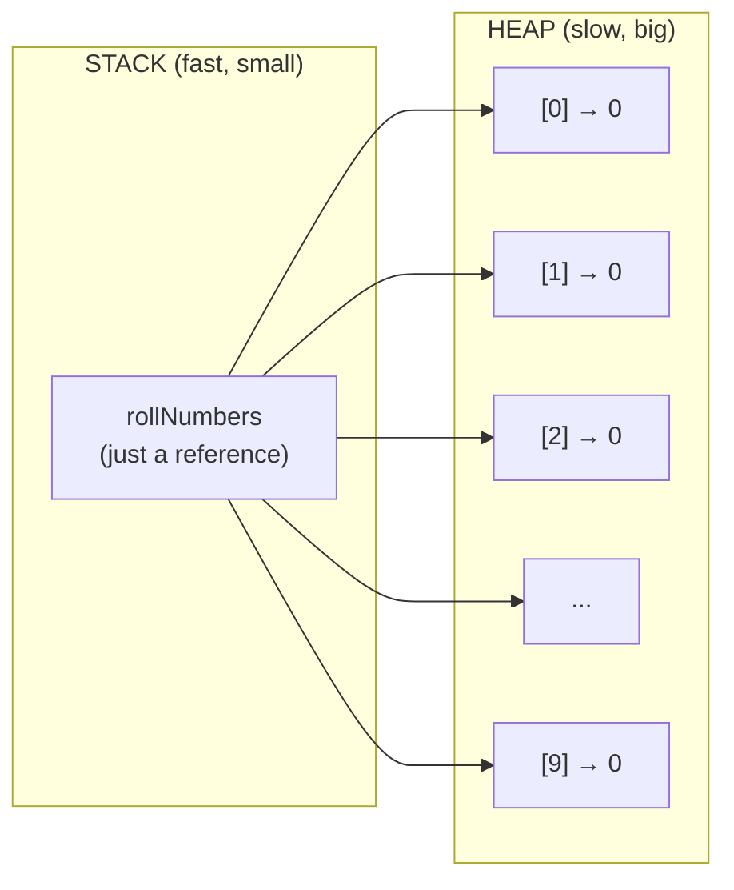
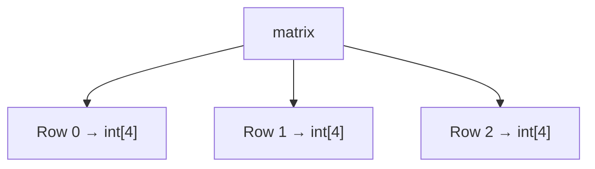
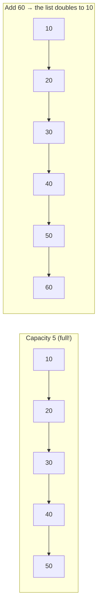

# 📚 Arrays in Java

> An **array** is a data structure that stores **multiple values of the same type** in a single, indexed structure.

Think of an array like a **row of lockers** 🗄️. Each locker has a **number** (the *index*) and holds exactly **one item**. The magic? You can open *any* locker **instantly** just by knowing its number — no searching required.

---

# Part 1 — 🤔 Why Do We Even Need Arrays?

## The Problem

Suppose we want to store the roll numbers of students. For 2–3 students, plain variables are fine:

```java
int roll1 = 101;
int roll2 = 102;
int roll3 = 103;
```

But what about a **database of 500 students**? Can you imagine writing 500 variables?

```java
int roll1 = ...; int roll2 = ...; int roll3 = ...;   // 😵 500 lines!
```

It's impractical — and it's **impossible to loop over**. What if a professor wants the average of all 500 rolls? You'd write 500 additions by hand.

## The Solution

👉 **Arrays** let us store all values in **one structure**, accessed by index:

| With 500 variables | With one array |
|--------------------|----------------|
| `roll1`, `roll2`, `roll3`... `roll500` | `rolls[0]`, `rolls[1]`, ... `rolls[499]` |
| Must declare 500 names | One declaration, 500 slots |
| Can't loop over them | `for (int i = 0; i < 500; i++)` |
| Sum = 500 handwritten additions | Sum = a tiny loop |

**Definition (Java perspective):** An array is a **contiguous block of memory** that holds elements of a **single, specific type**.

---

# Part 2 — 📘 Syntax: Declare, Initialize, Use

## The Three-Step Dance

```java
datatype[] variableName = new datatype[size];
//    ↑          ↑               ↑
//  (1) type    (2) name       (3) create it
```

**Examples:**

```java
// Array of 10 student roll numbers
int[] rollNumbers = new int[10];

// Array of 10 student names
String[] studentNames = new String[10];

// Direct initialization (size is inferred!)
int[] nums = {1, 2, 3, 4, 5};
```

## 🧪 What Actually Happens in Memory?

Let's trace `int[] rollNumbers = new int[10];` step by step:

```
Step 1: int[] rollNumbers        → a BOX called rollNumbers is created
                                    (empty — no memory for elements yet)

Step 2: new int[10]              → the JVM allocates 10 ints in HEAP
                                    [0][1][2][3][4][5][6][7][8][9]
                                    (all set to 0 — default value!)

Step 3: rollNumbers = ...        → the BOX now points to those 10 slots
```

> 👉 **LHS** (left side) = **declaration** — says "this variable *will* be an array of ints."  
> 👉 **RHS** (right side) = **initialization** — *actually creates* the array in memory.  
> ⚠️ **Declaration alone allocates no memory.** Only `new` (or direct initialization) does.

## The Golden Rules of Array Syntax

| Rule | Why it matters |
|------|----------------|
| **Declaration happens at compile time** | The compiler checks the type & name |
| **Initialization happens at runtime** | Memory is granted when `new` executes |
| **Size must be known at creation** | Arrays are fixed-length, forever |
| **Access by `arr[index]`** | Index starts at 0, ends at `length - 1` |

---

# Part 3 — 🧠 Memory Model: Stack vs Heap

## The Two-Story House



| Location | What lives there | Size | Speed |
|----------|------------------|------|-------|
| **Stack** | The **reference variable** (`rollNumbers`) | Tiny | ⚡ Fast |
| **Heap** | The **actual array object** (all 10 slots) | Big | 🐢 Slower |

> 🧠 **Mental model:** the stack holds the *address*, the heap holds the *goods*. `rollNumbers` is just a **postal address** pointing to a **warehouse** of 10 boxes.

## 🧪 Trace It — Passing an Array to a Method

```java
void printFirst(int[] arr) {
    System.out.println(arr[0]);
}

int[] nums = {42, 7, 99};
printFirst(nums);          // prints 42
```

```
main:      nums ──► [ heap: {42, 7, 99} ]
                     ▲
printFirst: arr ─────┘
```

Java passes **the reference (address) by value**. Both `nums` and `arr` point to the **same heap object**. So if the method changes `arr[0]`, the original array changes too! This is the #1 source of "why did my array get modified?!" confusion.

> ⚠️ **Contiguity caveat:** primitive arrays *are* contiguous in memory. Object arrays store **references contiguously** — the objects themselves may be scattered across the heap.

---

# Part 4 — 🌟 Key Features & Default Values

## The Five Superpowers

1. **Stores primitives AND objects** — `int`, `char`, `boolean`... or `String`, `Integer`, custom classes.
2. **Contiguous memory** — elements sit next to each other (or references do).
3. **Zero-based indexing** — first element at `0`, last at `length - 1`.
4. **Fixed length** — set once, never changes. (Need growth? → `ArrayList`.)
5. **Random access O(1)** — `arr[999]` is as fast as `arr[0]`. No traversal needed!

```java
int[] arr = {10, 20, 30, 40, 50};
// index:     0   1   2   3   4
// arr[0] = 10   arr[4] = 50
```

## 🎯 What's Inside a Fresh Array?

When you create an array, every slot gets a **default value** — no garbage, no random memory:

| Datatype | Default Value |
|----------|---------------|
| `int` | `0` |
| `double` / `float` | `0.0` |
| `boolean` | `false` |
| `char` | `'\u0000'` (null char) |
| `String` / Objects | `null` |

```java
int[] nums = new int[5];
System.out.println(nums[3]);   // 0  (NOT garbage!)
```

> 💡 Unlike C/C++, a fresh Java array is **never** full of random junk. That's the JVM guaranteeing safety.

---

# Part 5 — ⌨️ Array Input/Output (I/O)

## The Classic Loop

```java
Scanner sc = new Scanner(System.in);

int[] arr = new int[5];
for (int i = 0; i < arr.length; i++) {
    arr[i] = sc.nextInt();      // read into each slot
}
for (int i = 0; i < arr.length; i++) {
    System.out.print(arr[i] + " ");   // print each slot
}
```

## The Enhanced For Loop (read-only!)

```java
for (int num : arr) {
    System.out.print(num + " ");
}
```

> ⚠️ **BIG gotcha:** the enhanced loop hands you a **copy** of each value, not the slot. You **cannot modify** the array through it:

```java
for (int num : arr) {
    num = 99;       // ❌ arr[i] is UNCHANGED — num is a copy!
}
```

## The Utility Shortcuts

```java
import java.util.Arrays;

Arrays.toString(arr);    // "[1, 2, 3, 4, 5]" — pretty print
Arrays.sort(arr);        // sorts in place
Arrays.fill(arr, 0);     // fill all slots with 0
Arrays.copyOf(arr, 10);  // copy into a new (bigger) array
Arrays.equals(a, b);     // compare CONTENTS (not references!)
```

[Refer code](InputOutput.java)

---

# Part 6 — 🔢 Multidimensional Arrays

## What Is a 2D Array?

An array **of arrays** — think of a **spreadsheet** 📊 with rows and columns.

```java
datatype[][] varName = new datatype[rowSize][colSize];
```

```java
int[][] matrix = new int[3][4];   // 3 rows, 4 columns
```

## 🧪 The JVM Reality — "Array of Arrays"

In Java, `matrix` is NOT one big rectangle. It's a **box holding 3 boxes**, each box holding 4 ints:



This "array of arrays" design gives you a superpower: **jagged arrays** — rows of different lengths!

```java
int[][] jagged = new int[3][];
jagged[0] = new int[2];   // row 0 → 2 columns
jagged[1] = new int[4];   // row 1 → 4 columns
jagged[2] = new int[3];   // row 2 → 3 columns
```

```
Row 0: [10, 20]
Row 1: [30, 40, 50, 60]
Row 2: [70, 80, 90]
```

## Key Points

- **`rowSize` is mandatory**; `colSize` is **optional** (JVM only needs the row count; each row is created separately).
- **`.length`** on a 2D array returns the **number of rows** — not cells!
- To get columns: `arr[row].length`.

---

# Part 7 — 📖 ArrayList: The Array That Grows

## The Problem with Fixed Arrays

Arrays are **fixed-size**. But real programs don't always know sizes in advance — think of a **shopping cart** 🛒 that keeps growing as you add items.

## Enter ArrayList

`ArrayList` is a **dynamic array** — it grows and shrinks automatically.

```java
import java.util.ArrayList;

ArrayList<datatype> variableName = new ArrayList<>(initialSize);
```

**Example:**

```java
ArrayList<Integer> numList = new ArrayList<>(5);    // Wrapper class for int
ArrayList<String> namesList = new ArrayList<>(4);   // Strings
```

## The Everyday Methods

```java
numList.add(10);        // append → [10]
numList.add(20);        //         → [10, 20]
numList.get(0);         // 10
numList.set(1, 99);     // [10, 99]
numList.remove(0);      // [99]
numList.size();         // 1 (current count)
```

> ⚠️ For primitives, use **wrapper classes** (`Integer`, `Double`, `Character`) — `ArrayList<int>` won't compile!

## 🧪 How ArrayList Grows (The Secret Sauce)

Watch what happens when we keep adding to a list with capacity 5:



1. Internally, ArrayList wraps a **plain fixed-size array** (default capacity 10).
2. When it fills up, it creates a **new array ~2× bigger**.
3. It **copies every element** over (O(n) — the painful step).
4. The old array is **discarded** (Garbage Collector reclaims it).

> 💡 **Amortized O(1):** the rare O(n) copy is paid for by the many O(1) adds before it. On average, `add()` is O(1).

[Refer Code for ArrayList](ArrayListExample.java)  
[Refer Code for MultiArrayList](MultiArrayList.java)

---

# Part 8 — 🔄 Swap & 🔁 Reverse: The Two-Pointer Pattern

## Swap — Why Can't We Just Swap Two Variables?

In Java, you **cannot swap two variables directly** like in C++ (no pointer tricks). But inside an array, swapping elements is easy — because we're mutating a **shared object**:

```java
void swap(int[] arr, int i, int j) {
    int temp = arr[i];   // 1. save one side
    arr[i] = arr[j];     // 2. overwrite i with j
    arr[j] = temp;       // 3. put the saved value into j
}
```

> 💡 The classic **temp dance**: *save → overwrite → restore*. Every swap in every algorithm uses this.

## Reverse — Watch the Pointers Meet

**Approach:** two pointers — `start` creeping right, `end` creeping left, swapping as they go. They stop when they cross.

**Visual Trace — Reverse `[1, 2, 3, 4, 5]`:**

```
[1, 2, 3, 4, 5]   start=0, end=4 → swap 1 ↔ 5
[5, 2, 3, 4, 1]   start=1, end=3 → swap 2 ↔ 4
[5, 4, 3, 2, 1]   start=2, end=2 → CROSSED! stop ✅
```

```java
void reverse(int[] arr) {
    int start = 0, end = arr.length - 1;
    while (start < end) {          // keep going until they meet
        swap(arr, start, end);     // swap the ends
        start++;                   // move right pointer forward
        end--;                     // move left pointer backward
    }
}
```

**Complexity:** O(n) time, O(1) space — no extra array, just a `temp` variable.

[Refer Code](SwapInArray.java) · [Refer Code](ReverseArray.java)

---

# ⚠️ Common Mistakes (Read Before You Code!)

### 1. Off-by-one — the #1 array bug

```java
int[] arr = {10, 20, 30};
arr[1] = 10;   // ❌ WRONG! arr[1] is 20 (second element)
arr[0] = 10;   // ✅ first element lives at index 0
```

### 2. Declaration ≠ Initialization

```java
int[] arr;          // ❌ declares a reference... but nothing allocated yet!
arr[0] = 5;         // 💥 NullPointerException — no array exists
int[] arr = new int[5];   // ✅ now memory exists
```

### 3. Out-of-bounds access

```java
int[] arr = new int[5];
arr[5] = 10;   // ❌ valid indices are 0–4 → ArrayIndexOutOfBoundsException!
arr[4] = 10;   // ✅ last valid slot
```

### 4. `.length` vs `.length()` — mixing up field and method

```java
int[] arr = {1, 2, 3};
arr.length;      // ✅ 3 — a FIELD (no parentheses)

String s = "hi";
s.length();      // ✅ 2 — a METHOD (with parentheses)
s.length;        // ❌ compile error
```

### 5. Enhanced loop won't modify the array

```java
for (int num : arr) {
    num = 99;   // ❌ num is a copy — arr[i] unchanged!
}
```

### 6. Forgetting arrays are fixed-size

```java
arr.length = 10;   // ❌ compile error — can't resize
// Use ArrayList when you need dynamic size.
```

### 7. Object arrays: references contiguous, objects scattered

```java
String[] names = new String[3];   // 3 reference slots — contiguous
names[0] = new String("Ajith");   // the String OBJECT may live anywhere in heap
```

---

# 📌 Array vs ArrayList — The Showdown

| Aspect | Array | ArrayList |
|--------|-------|-----------|
| Size | Fixed | Dynamic |
| Primitives | ✅ Direct | ❌ Needs wrapper (`Integer`) |
| Performance | ⚡ Faster | Slightly slower |
| Random access | O(1) | O(1) |
| Insert/delete middle | O(n) shift | O(n) shift |
| Methods | None built-in | Rich API (`add`, `remove`...) |
| Memory | Tight | Extra (capacity headroom) |

**Rule of thumb:** Size known upfront & performance matters → **Array**. Size changes / rich API needed → **ArrayList**.

---

# 🧠 Practice: Think by Hand

**Exercise 1 — Predict the output:**

```java
int[] a = {1, 2, 3, 4};
int[] b = a;          // what does b point to?
b[0] = 99;
System.out.println(a[0]);   // ?
```

> *Hint: `b = a` copies the ADDRESS, not the array. Both point to the same heap object.*

**Exercise 2 — Spot the bug.** This code crashes. Why?

```java
int[] scores = new int[3];
for (int i = 0; i <= scores.length; i++) {
    scores[i] = i * 10;   // 💥
}
```

**Exercise 3 — Design it.** Without using another array, reverse `[1, 2, 3, 4, 5]` **in place**. (You already saw the answer — can you rewrite it from memory?)

---

# 📝 Quick Revision Cheatsheet

* **Syntax:** `datatype[] arr = new datatype[size];`
* **Indexing:** Starts at `0`, last = `length - 1`
* **Default Values:** `int → 0`, `String → null`, `float → 0.0`, `boolean → false`
* **Fixed Size:** Cannot be changed after creation
* **Memory:** object in **heap**, reference in **stack**
* **Passing to methods:** passes the *address* — mutations affect the original
* **2D Arrays:** `datatype[][] arr = new datatype[rows][cols];` → array of arrays
* **Jagged Arrays:** rows can have different lengths
* **I/O:** `for` loops or `java.util.Arrays` utilities
* **Reverse:** two pointers (`start` & `end` swap until they cross)
* **ArrayList:** dynamic, wrapper classes for primitives, amortized O(1) add

---

# 🎯 Key Takeaways

1. **Arrays = same-type values + instant index access** — that's the whole deal
2. **Zero-based indexing** causes more bugs than any other rule — always `length - 1`
3. **The reference lives on the stack, the data lives on the heap** — and methods share the data
4. **Fixed size forever** — reach for `ArrayList` when you need growth
5. **`.length`** for arrays, **`.length()`** for strings — the parens matter
6. **Two-pointer pattern** (swap ends, walk inward) is your go-to for reverse/two-sum
7. **Trace before you code** — drawing the lockers makes every bug obvious

> *"An array is just a row of lockers — know the number, and you're already there."* 🔑😄