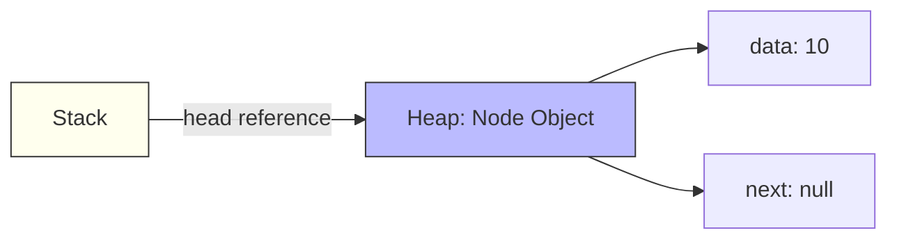
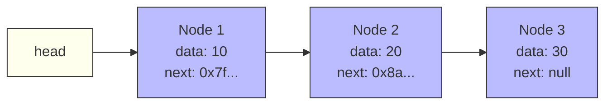
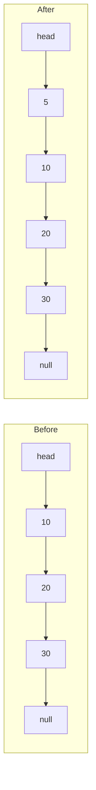
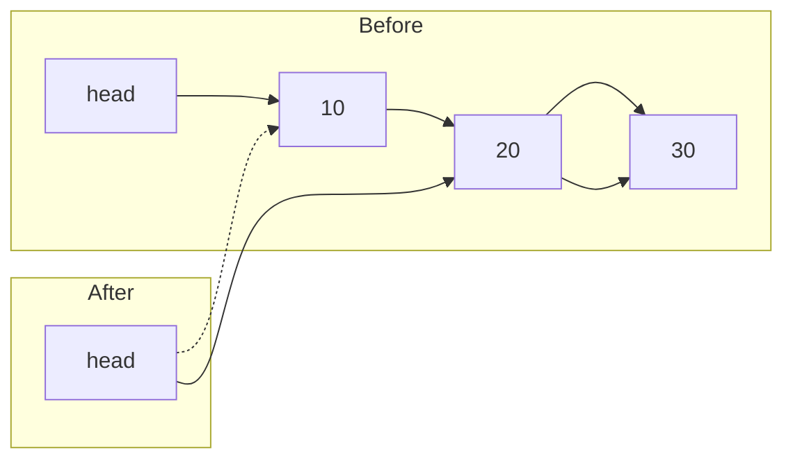
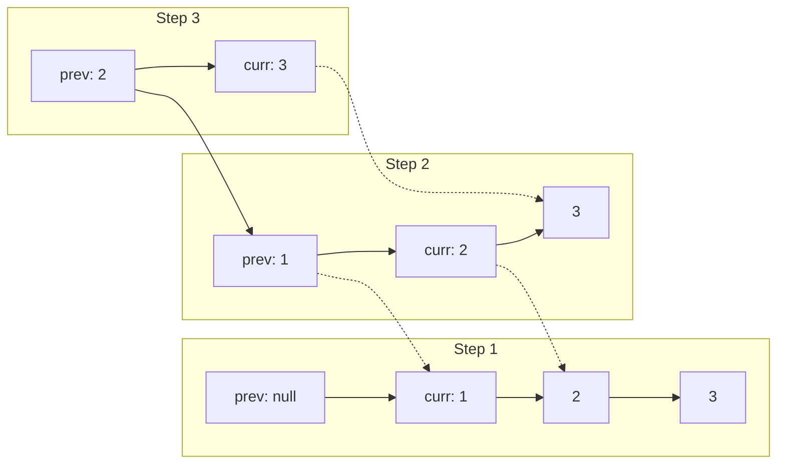

# 🔗 Linked Lists in Java

> A **Linked List** is a linear data structure where elements (nodes) are stored **non-contiguously** in memory, connected by **pointers (references)**.

Think of it like a **treasure hunt** — each clue (node) tells you where the next one is hidden. You can't jump to clue #5 directly; you must follow the chain from the start.

---

## 📌 Why Not Arrays? — The Motivation

| Array / ArrayList | Linked List |
|-------------------|-------------|
| Fixed size (arrays) or costly resize (ArrayList) | **Dynamic size** — grow/shrink freely |
| Insert/delete in middle = **O(n)** shift | Insert/delete at known position = **O(1)** |
| Contiguous memory → cache friendly | Non-contiguous → **cache misses** |
| Random access `arr[i]` = **O(1)** | No random access — must traverse **O(n)** |
| Memory overhead = low | Memory overhead = **extra pointer per node** |

> **Rule of Thumb:** Use **ArrayList** for random access & iteration. Use **LinkedList** for frequent insert/delete at head/tail/middle.

---

## 📌 Node Anatomy — The Building Block

```java
class Node {
    int data;       // The value (payload)
    Node next;      // Reference to next node (the "link")
    
    Node(int data) {
        this.data = data;
        this.next = null;
    }
}
```

### Visual: Single Node in Memory



### Visual: Linked List of 3 Nodes



> 💡 **Key Insight:** Nodes are scattered in heap memory. The `next` reference is the **only thread** connecting them.

---

## 📌 JVM Memory Model — Stack vs Heap

```
STACK (method frames)          HEAP (objects)
┌─────────────────────┐        ┌─────────────────────┐
│ main()              │        │ Node @ 0x7f...      │
│  head ──────────────┼───────►│ data: 10            │
│                     │        │ next: 0x8a...       │
│ insertAtHead()      │        ├─────────────────────┤
│  newNode ───────────┼───────►│ Node @ 0x8a...      │
│  temp               │        │ data: 20            │
└─────────────────────┘        │ next: null          │
                               └─────────────────────┘
```

- **Stack:** Holds **references** (`head`, `temp`, `newNode`) — fast, auto-cleaned on method return
- **Heap:** Holds **actual Node objects** — created with `new`, cleaned by **Garbage Collector** when unreachable

---

## 📌 Types of Linked Lists

### 1️⃣ Singly Linked List

```
head → [10|next] → [20|next] → [30|next] → null
```

- One pointer: `next`
- Forward traversal only
- Simplest, least memory

---

### 2️⃣ Doubly Linked List

```
null ← [prev|10|next] ⇄ [prev|20|next] ⇄ [prev|30|next] → null
       ▲                                             ▲
      head                                          tail (optional)
```

- Two pointers: `prev` and `next`
- Bidirectional traversal
- Easier deletion (don't need to find previous node)

---

### 3️⃣ Circular Linked List

```
      ┌──────────────────────┐
      ▼                      │
head → [10|next] → [20|next] → [30|next] ─┘
```

- Last node points back to `head`
- Can be singly or doubly circular
- Useful for round-robin scheduling, playlists

---

## 📌 Core Operations — Step by Step

### 🟢 Singly Linked List

#### Insert at Head — O(1)

```java
void insertAtHead(int data) {
    Node newNode = new Node(data);  // 1. Create node
    newNode.next = head;            // 2. New node points to old head
    head = newNode;                 // 3. Head points to new node
}
```

**Visual Trace — Insert 5 at head of `10 → 20 → 30`:**



**Why O(1)?** No traversal — just 3 pointer reassignments.

---

#### Insert at Tail — O(n) without tail pointer

```java
void insertAtTail(int data) {
    Node newNode = new Node(data);
    if (head == null) {
        head = newNode;
        return;
    }
    Node temp = head;
    while (temp.next != null) {  // Traverse to last node
        temp = temp.next;
    }
    temp.next = newNode;         // Link last node to new node
}
```

> 💡 **Optimization:** Maintain a `tail` reference → **O(1)** tail insertion.

---

#### Delete at Head — O(1)

```java
void deleteHead() {
    if (head != null) {
        head = head.next;  // GC collects old head automatically
    }
}
```

**Visual:**



> 💡 Old head (10) becomes **unreachable** → **Garbage Collector** reclaims it.

---

#### Delete at Tail — O(n)

```java
void deleteTail() {
    if (head == null) return;
    if (head.next == null) {  // Only one node
        head = null;
        return;
    }
    Node temp = head;
    while (temp.next.next != null) {  // Stop at second-last
        temp = temp.next;
    }
    temp.next = null;  // Unlink last node
}
```

---

#### Search by Value — O(n)

```java
boolean search(int key) {
    Node temp = head;
    while (temp != null) {
        if (temp.data == key) return true;
        temp = temp.next;
    }
    return false;
}
```

---

#### Traversal — O(n)

```java
void printList() {
    Node temp = head;
    while (temp != null) {
        System.out.print(temp.data + " -> ");
        temp = temp.next;
    }
    System.out.println("null");
}
```

---

### 🟢 Doubly Linked List — Extra Power

#### Insert at Head — O(1)

```java
void insertAtHead(int data) {
    DNode newNode = new DNode(data);
    newNode.next = head;
    if (head != null) head.prev = newNode;  // Fix old head's prev
    head = newNode;
}
```

#### Delete at Tail — O(1) with tail pointer

```java
void deleteTail() {
    if (tail == null) return;
    if (head == tail) {  // Single node
        head = tail = null;
        return;
    }
    tail = tail.prev;       // Move tail back
    tail.next = null;       // Unlink old tail
}
```

> 💡 **Doubly LL superpower:** Delete at tail in O(1) because `tail.prev` gives you the previous node directly!

---

### 🟢 Circular Linked List

#### Traversal — Do-While Loop

```java
void printList() {
    if (head == null) return;
    CNode temp = head;
    do {
        System.out.print(temp.data + " -> ");
        temp = temp.next;
    } while (temp != head);  // Stop when back at head
    System.out.println("(back to head)");
}
```

> ⚠️ **Must use `do-while`** — `while` would skip the first node since `temp == head` initially.

---

## 📌 Common Patterns & Templates

### Pattern 1: Find Middle Node (Fast/Slow Pointers)

```java
Node findMiddle(Node head) {
    Node slow = head, fast = head;
    while (fast != null && fast.next != null) {
        slow = slow.next;        // 1 step
        fast = fast.next.next;   // 2 steps
    }
    return slow;  // When fast reaches end, slow is at middle
}
```

**Why it works:** Fast moves 2× speed → when fast finishes, slow is halfway.

---

### Pattern 2: Detect Cycle (Floyd's Algorithm)

```java
boolean hasCycle(Node head) {
    Node slow = head, fast = head;
    while (fast != null && fast.next != null) {
        slow = slow.next;
        fast = fast.next.next;
        if (slow == fast) return true;  // Met = cycle exists
    }
    return false;
}
```

---

### Pattern 3: Reverse a Singly Linked List (Iterative)

```java
Node reverse(Node head) {
    Node prev = null;
    Node curr = head;
    while (curr != null) {
        Node next = curr.next;  // Save next
        curr.next = prev;       // Reverse pointer
        prev = curr;            // Move prev forward
        curr = next;            // Move curr forward
    }
    return prev;  // New head
}
```

**Visual Trace — Reverse `1 → 2 → 3`:**



---

### Pattern 4: Merge Two Sorted Lists

```java
Node merge(Node l1, Node l2) {
    Node dummy = new Node(0);
    Node tail = dummy;
    
    while (l1 != null && l2 != null) {
        if (l1.data < l2.data) {
            tail.next = l1;
            l1 = l1.next;
        } else {
            tail.next = l2;
            l2 = l2.next;
        }
        tail = tail.next;
    }
    tail.next = (l1 != null) ? l1 : l2;  // Attach remainder
    return dummy.next;
}
```

> 💡 **Dummy node trick** — avoids special case for head.

---

## 📌 Common Mistakes ⚠️

### 1. Losing the Head Reference

```java
// ❌ WRONG — head lost forever!
head = head.next;
// ... later you want to print list but head is gone

// ✅ CORRECT — save head or use temp
Node temp = head;
while (temp != null) { ... }
```

### 2. NullPointerException on Empty List

```java
// ❌ Crashes if head is null
System.out.println(head.data);

// ✅ Always check first
if (head != null) System.out.println(head.data);
```

### 3. Forgetting to Update `prev` in Doubly LL

```java
// ❌ Old head's prev still points to new node!
newNode.next = head;
head = newNode;

// ✅ Fix both directions
newNode.next = head;
if (head != null) head.prev = newNode;
head = newNode;
```

### 4. Infinite Loop in Circular List Traversal

```java
// ❌ while loop — never enters if head != null initially
while (temp != head) { ... }

// ✅ do-while — runs at least once
do { ... } while (temp != head);
```

### 5. Memory Leaks — Unreachable But Referenced

```java
// ❌ Node still referenced → not GC'd
Node temp = head;
head = head.next;
// temp still points to old head!

// ✅ Null out references you don't need
temp = null;  // Help GC (optional in Java, good practice)
```

---

## 📌 Time Complexity Summary

| Operation | Singly LL | Doubly LL | Circular LL | ArrayList |
|-----------|-----------|-----------|-------------|-----------|
| Access by index | O(n) | O(n) | O(n) | **O(1)** |
| Search by value | O(n) | O(n) | O(n) | O(n) |
| Insert at head | **O(1)** | **O(1)** | **O(1)** | O(n) |
| Insert at tail* | O(n) | **O(1)** | **O(1)** | **O(1)** amortized |
| Insert at middle | O(n) | O(n) | O(n) | O(n) |
| Delete at head | **O(1)** | **O(1)** | **O(1)** | O(n) |
| Delete at tail | O(n) | **O(1)** | O(n) | **O(1)** |
| Delete at middle | O(n) | O(n) | O(n) | O(n) |
| Space overhead | 1 ptr | 2 ptrs | 1 ptr | Low (but resize) |

*With tail pointer maintained

---

## 📌 When to Use Which?

| Scenario | Best Choice |
|----------|-------------|
| Frequent add/remove at **both ends** | `Deque` (ArrayDeque) or Doubly LL |
| Frequent add/remove at **head only** | Singly LL |
| Need **random access** by index | ArrayList |
| **Unknown size**, mostly sequential access | LinkedList |
| **Round-robin** / circular buffer | Circular LL |
| **Undo/redo** functionality | Doubly LL |
| **LRU Cache** | Doubly LL + HashMap |

---

## 📌 Practice Problems (Progressive)

1. **Easy:** Print list, count nodes, search value
2. **Easy:** Insert at head/tail, delete head
3. **Medium:** Reverse list (iterative + recursive)
4. **Medium:** Find middle, detect cycle
5. **Medium:** Merge two sorted lists
6. **Medium:** Remove nth node from end
7. **Hard:** Reverse in k-groups, add two numbers
8. **Hard:** Flatten multilevel doubly LL
9. **Hard:** Copy list with random pointer

---

## 📝 Quick Revision Cheatsheet

* **Node** = data + next reference (singly) / prev + next (doubly)
* **Head** = entry point reference (on stack, points to heap)
* **Null** = end of list (singly) / both ends (doubly)
* **Circular** = last.next = head (no null)
* **Insert at head** = 3 pointer changes → O(1)
* **Insert at tail** = O(n) without tail ptr, O(1) with
* **Delete** = bypass node (fix prev.next / next.prev)
* **Traversal** = while(temp != null) for linear, do-while for circular
* **Fast/Slow pointers** = cycle detection, middle finding
* **Dummy node** = simplifies head-edge cases
* **GC** = collects unreachable nodes automatically in Java

---

## 🎯 Key Takeaways

1. **Linked Lists trade random access for dynamic inserts/deletes**
2. **Always draw the pointers** before coding — visualize the links
3. **Edge cases:** empty list, single node, head/tail operations
4. **Dummy node** saves you from special-casing head
5. **Fast/Slow pointers** are the Swiss Army Knife for LL problems
6. **Doubly LL** = twice the pointers, half the traversal pain
7. **Java GC** handles memory — but don't create accidental cycles you don't want