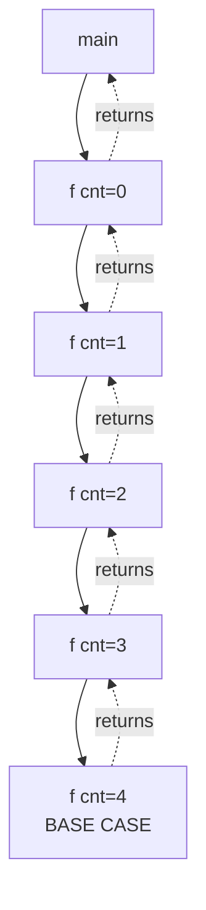

# 🔁 Recursion

> **Recursion is when a function calls itself, until a specified condition is met.**

It's one of the most elegant concepts in programming — solving a problem by breaking it into smaller instances of the *same* problem.

---

## 📘 The Simplest Recursion (and Why It Crashes)

```java
void f() {
    System.out.println(1);
    f();   // calls itself forever
}

public static void main(String[] args) {
    f();
}
```

**Output:**
```
1
1
1
1
1
...
Exception in thread "main" java.lang.StackOverflowError
```

### 🤔 Why Does This Crash?

Every time a function is called, Java creates a **stack frame** on the **call stack** — a block of memory that holds:
- Local variables
- Parameters
- The return address (where to go after the function finishes)

```
Call Stack (growing upward):

┌─────────────────────┐
│      f() #1000      │  ← newest frame (top of stack)
├─────────────────────┤
│      f() #999       │
├─────────────────────┤
│        ...          │
├─────────────────────┤
│      f() #2         │
├─────────────────────┤
│      f() #1         │  ← first frame (bottom)
├─────────────────────┤
│     main()          │
└─────────────────────┘
```

Each call to `f()` pushes a **new frame on top**. Since there's no stopping condition, frames keep piling up until the stack memory is exhausted → **StackOverflowError**.

> 💡 **Key Insight:** The call stack has limited size (~1MB default in Java). Infinite recursion = guaranteed crash.

---

## 📘 The Fix: Base Condition

The **base condition** (or base case) is the *"specified condition"* that tells recursion when to **stop**.

```java
static int cnt = 0;   // static so it's shared across all calls

void f() {
    if (cnt == 4) return;   // ✅ BASE CONDITION — stops recursion
    System.out.print(cnt + " ");
    cnt++;
    f();                    // recursive call
}

public static void main(String[] args) {
    f();
}
```

**Output:** `0 1 2 3`

### What Changed?

| Without Base Case | With Base Case |
|-------------------|----------------|
| Infinite calls | Stops when `cnt == 4` |
| Stack overflow | Stack unwinds cleanly |
| No return path | Each call returns to its caller |

### Step-by-Step Execution Trace

```
main() calls f()
│
├─ f() #1: cnt=0 → prints 0, cnt=1, calls f()
│   │
│   ├─ f() #2: cnt=1 → prints 1, cnt=2, calls f()
│   │   │
│   │   ├─ f() #3: cnt=2 → prints 2, cnt=3, calls f()
│   │   │   │
│   │   │   ├─ f() #4: cnt=3 → prints 3, cnt=4, calls f()
│   │   │   │   │
│   │   │   │   ├─ f() #5: cnt=4 → BASE CASE HIT → returns
│   │   │   │   │
│   │   │   │   ← f() #4 returns
│   │   │   ← f() #3 returns
│   │   ← f() #2 returns
│   ← f() #1 returns
← main() continues
```

**Notice:** The base case is checked **before** the recursive call. This is crucial — it prevents the unnecessary frame from being created.

---

## 📘 Recursion Tree

A **recursion tree** visualizes how calls branch and unwind. For the linear example above:



**For branching recursion** (like Fibonacci), the tree fans out:

```mermaid
graph TD
    A[fib(4)] --> B[fib(3)]
    A --> C[fib(2)]
    B --> D[fib(2)]
    B --> E[fib(1)]
    C --> F[fib(1)]
    C --> G[fib(0)]
    D --> H[fib(1)]
    D --> I[fib(0)]
    style A fill:#f9f,stroke:#333
    style F fill:#bbf,stroke:#333
    style G fill:#bbf,stroke:#333
    style E fill:#bbf,stroke:#333
    style H fill:#bbf,stroke:#333
    style I fill:#bbf,stroke:#333
```

> 💡 Green nodes = base cases. Notice how `fib(2)` is computed **twice** — this redundancy is why naive recursion can be slow.

---

## 📘 Anatomy of Every Recursive Function

Every correct recursive function has **exactly two parts**:

```java
void recursiveFunction(parameters) {
    // 1️⃣ BASE CASE — when to stop
    if (baseCondition) {
        return baseValue;   // or just return; for void
    }

    // 2️⃣ RECURSIVE CASE — call yourself with smaller input
    //    ... do some work ...
    recursiveFunction(smallerInput);
    //    ... maybe do more work after the call returns ...
}
```

### The Golden Rules

| Rule | Why It Matters |
|------|----------------|
| **Always have a base case** | Without it → StackOverflowError |
| **Every call must progress toward base case** | If input doesn't get "smaller" → infinite recursion |
| **Base case must be reachable** | If logic skips it → infinite recursion |

---

## 📘 How the Call Stack Unwinds (The "Return Journey")

When the base case is hit, the function **returns**. Then each caller resumes **after** its recursive call.

```java
void printAscending(int n) {
    if (n == 0) return;       // base case
    printAscending(n - 1);    // recursive call FIRST
    System.out.print(n + " "); // processing AFTER (on the way back)
}
```

**Call: `printAscending(3)`**

```
Stack frames pushed (going down):
printAscending(3)  → calls printAscending(2)
printAscending(2)  → calls printAscending(1)
printAscending(1)  → calls printAscending(0)
printAscending(0)  → BASE CASE, returns immediately

Stack frames popped (coming up — unwinding):
printAscending(1) resumes → prints 1
printAscending(2) resumes → prints 2
printAscending(3) resumes → prints 3
```

**Output:** `1 2 3`

> 💡 **Head Recursion:** Processing happens *after* the recursive call (during unwind).  
> **Tail Recursion:** Processing happens *before* the recursive call (no unwind work).

---

## 📘 Common Patterns from Your Examples

### Pattern 1: Counter with Base Case (Your Example)

```java
static int cnt = 0;

void countTo(int limit) {
    if (cnt == limit) return;   // base case
    System.out.println(cnt);
    cnt++;
    countTo(limit);
}
```

**Output for `countTo(4)`:** `0 1 2 3`

---

### Pattern 2: Countdown (Tail Recursion)

```java
void countdown(int n) {
    if (n == 0) {               // base case
        System.out.println("Liftoff! 🚀");
        return;
    }
    System.out.println(n);
    countdown(n - 1);           // tail call — last statement
}
```

**Output for `countdown(3)`:** `3 2 1 Liftoff! 🚀`

---

### Pattern 3: Count Up (Head Recursion)

```java
void countUp(int n) {
    if (n == 0) return;         // base case
    countUp(n - 1);             // recursive call FIRST
    System.out.println(n);      // print AFTER returning
}
```

**Output for `countUp(3)`:** `1 2 3`

---

## 📘 The Two Faces of Recursion: Parameterized vs Functional

There are **two styles** of recursion — and the difference is *where the work happens*:

> 🧠 **Mental model:** the recursion has two journeys — **going down** (each call goes deeper) and **coming back up** (each call returns to its caller).
>
> - **Parameterized recursion** does the work **on the way down** — the answer is *carried* in an extra parameter (the **accumulator**).
> - **Functional recursion** does the work **on the way back up** — each call *returns a value* that the caller combines into a bigger result.

The classic example for both: **sum of the first N natural numbers**.

---

### 🔵 Parameterized Recursion — "Carry the answer down"

> **Idea:** Pass a *running result* (accumulator) as a parameter. Every call adds its contribution and hands the growing total to the next call. When the base case hits, the accumulator **already holds the answer**.

```java
static int sum(int n, int acc) {
    if (n == 0) return acc;          // base case → answer is IN acc 🎯
    return sum(n - 1, acc + n);      // carry the running total downward
}

// Call: sum(5, 0)
```

**🧪 Watch It Work — the work happens going DOWN:**

```
sum(5, 0)
├─ sum(4, 5)      ← acc = 0 + 5
│  ├─ sum(3, 9)   ← acc = 5 + 4
│  │  ├─ sum(2, 12)
│  │  │  ├─ sum(1, 14)
│  │  │  │  ├─ sum(0, 15)  → BASE CASE → return 15 🎯
```

> 🔑 **Notice:** every call adds to `acc` **before** recursing. By the time we reach `sum(0, 15)`, the sum is *complete* — the return journey just hands `15` straight back up. **No work is left to do on the way up.**

**Key traits of Parameterized Recursion:**

| Trait | What it means |
|-------|---------------|
| **Extra parameter** | The accumulator (`acc`) rides along in every call |
| **Work on the way down** | Each call updates `acc` *before* recursing |
| **Base case returns `acc`** | The answer is already computed when we stop |
| **Result flows straight back** | The return path does no extra math |

> 💡 Parameterized recursion is the style closest to **Tail Recursion** — the recursive call is the last statement, which is exactly why languages with *Tail Call Optimization* can turn it into a loop.

---

### 🟢 Functional Recursion — "Build the answer on the way back up"

> **Idea:** The function **returns** a value. The base case returns the *smallest possible answer*; every caller takes that answer, adds its own contribution, and returns a *bigger* answer. The real work happens as calls **unwind**.

```java
static int sum(int n) {
    if (n == 0) return 0;            // base case → smallest answer (0)
    return n + sum(n - 1);           // build the answer going UP ☝️
}

// Call: sum(5)
```

**🧪 Watch It Work — the work happens going UP:**

```
sum(5)                    ← waiting for sum(4)
└─ 5 + sum(4)             ← waiting for sum(3)
   └─ 4 + sum(3)          ← waiting for sum(2)
      └─ 3 + sum(2)       ← waiting for sum(1)
         └─ 2 + sum(1)    ← waiting for sum(0)
            └─ 1 + sum(0) → returns 0
            → 1 + 0 = 1   ☝️ now the unwinding begins!
         → 2 + 1 = 3
      → 3 + 3 = 6
   → 4 + 6 = 10
→ 5 + 10 = 15 ✅
```

> 🔑 **Notice the difference:** every `n + sum(n-1)` is **evaluated only after** the inner call returns. The additions happen on the way **up** — that's why functional recursion is the "head recursion" style of data flow.

**Key traits of Functional Recursion:**

| Trait | What it means |
|-------|---------------|
| **Returns a value** | Every call hands a result back to its caller |
| **Work on the way up** | The math (`n + ...`) waits for the inner result |
| **Base case returns the smallest answer** | e.g. `sum(0) = 0`, `fact(1) = 1` |
| **Recursive case combines** | Takes the child's answer + its own contribution |

---

### 🥊 The Showdown — Side by Side

| Aspect | 🔵 Parameterized | 🟢 Functional |
|--------|------------------|---------------|
| **Where work happens** | Going **down** (calls) | Coming **up** (returns) |
| **Extra accumulator param** | ✅ Yes | ❌ No |
| **Function returns the answer** | Returns `acc` at base | Combines `n + result` |
| **The base case** | Returns the *completed* accumulator | Returns the *smallest* answer |
| **Extra call-stack pressure** | None on return path | Each frame holds pending math |
| **Closest to** | Tail recursion | Head recursion |
| **Readability** | Slightly more params, obvious data flow | Clean signature, elegant one-liners |

**Same problem, both styles:**

```java
// 🔵 Parameterized — carry it down
static int sum(int n, int acc) {
    if (n == 0) return acc;
    return sum(n - 1, acc + n);
}

// 🟢 Functional — build it up
static int sum(int n) {
    if (n == 0) return 0;
    return n + sum(n - 1);
}

// Both print 15 for sum(5) ✅
```

---

### 📚 More Examples in Both Styles

**Factorial — Functional (natural fit):**

```java
static int factorial(int n) {
    if (n == 0 || n == 1) return 1;   // smallest answer
    return n * factorial(n - 1);      // combine on the way up
}
// factorial(4) = 4 * 3 * 2 * 1 = 24 ✅
```

**Factorial — Parameterized (carry the product):**

```java
static int factorial(int n, int acc) {
    if (n <= 1) return acc;
    return factorial(n - 1, acc * n);
}
// factorial(4, 1) → 4*1, then 3*4, then 2*12, then 1*24 → 24 ✅
```

**Reverse a String — Functional:**

```java
static String reverse(String s) {
    if (s.length() <= 1) return s;                    // smallest answer
    return reverse(s.substring(1)) + s.charAt(0);     // combine going up
}
// reverse("cat") → reverse("at") + 'c' → reverse("t") + 'a' + 'c' → "tac" ✅
```

**Countdown — Parameterized (carry the counter):**

```java
static void countdown(int n, int current) {
    if (current > n) return;                  // base case
    System.out.print(current + " ");
    countdown(n, current + 1);                // carry state downward
}
// countdown(3, 1) → "1 2 3" ✅
```

---

### 🌟 The Golden Rules of Parameterized vs Functional

| Rule | Why |
|------|-----|
| **Parameterized = data flows down** | State lives in the accumulator, base case reads it |
| **Functional = data flows up** | Base case returns the seed, callers combine it |
| **Parameterized uses `static`-free style** | No shared globals — state is passed, not mutated |
| **Pick the clearer one per problem** | Tree/graph traversal → functional feels natural; carrying a running total → parameterized is obvious |
| **Watch for accumulator reset** | Each call gets its *own copy* of `acc` — that's the point! |

---

## 📘 Recursion vs Iteration

| Aspect | Recursion | Iteration (Loop) |
|--------|-----------|------------------|
| **Memory** | O(n) stack frames | O(1) constant |
| **Readability** | Often cleaner for trees/graphs | Better for simple linear tasks |
| **Speed** | Function call overhead | Faster (no call overhead) |
| **Stack Overflow Risk** | Yes (deep recursion) | No |
| **Best For** | Divide & conquer, backtracking, trees | Simple counting, traversing arrays |

---

## 📘 Common Mistakes ⚠️

### 1. Missing Base Case
```java
// ❌ NEVER DO THIS
void f(int n) {
    f(n - 1);   // no base case = StackOverflowError
}
```

### 2. Not Progressing Toward Base Case
```java
// ❌ n increases, moving AWAY from base case
void f(int n) {
    if (n == 10) return;
    f(n + 1);   // infinite recursion!
}
```

### 3. Base Case Never Reached Due to Logic Error
```java
// ❌ For negative n, base case n==0 is never hit
void f(int n) {
    if (n == 0) return;
    f(n - 2);   // f(-1) → f(-3) → f(-5) ... infinite!
}
```

### 4. Forgetting `static` for Shared Counter (Your Example)
```java
// ❌ Without static, each call gets its own cnt=0
int cnt = 0;
void f() {
    if (cnt == 4) return;   // cnt is ALWAYS 0 here!
    System.out.println(cnt);
    cnt++;
    f();
}
```
**Fix:** Use `static int cnt = 0;` or pass counter as parameter.

---

## 📘 Practice: Trace the Recursion Tree

**Exercise:** Draw the recursion tree for:

```java
void mystery(int n) {
    if (n <= 0) return;
    System.out.print("A");
    mystery(n - 1);
    System.out.print("B");
}
```

**Call: `mystery(2)`**

```
mystery(2)
 ├─ print "A"
 ├─ mystery(1)
 │   ├─ print "A"
 │   ├─ mystery(0) → BASE CASE, returns
 │   └─ print "B"
 └─ print "B"
```

**Output:** `A A B B`

---

## 📝 Quick Revision Cheatsheet

* **Recursion** = function calls itself
* **Stack Frame** = memory block for each call (local vars, return address)
* **Call Stack** = stack of frames; limited size → StackOverflow if too deep
* **Base Case** = condition that stops recursion (MUST exist, MUST be reachable)
* **Recursive Case** = the self-call with smaller/simpler input
* **Head Recursion** = work done *after* recursive call (during unwind)
* **Tail Recursion** = recursive call is *last* statement
* **Parameterized Recursion** = carry the answer down in an **accumulator** parameter
* **Functional Recursion** = build the answer up as calls **return** values
* **Recursion Tree** = visual diagram of calls and returns
* **Golden Rule:** Every call must move closer to the base case

---

## 🎯 Key Takeaways

1. **Recursion uses the call stack** — each call waits for the next to finish
2. **Base case is non-negotiable** — it's the exit door
3. **Progress toward base case** — input must get "smaller" each call
4. **Trace by hand** — write the stack frames to understand flow
5. **Stack unwinds in reverse** — last called, first returned (LIFO)
6. **Parameterized vs Functional** — choose *where* the work lives: carried down in an accumulator, or built up through return values

> *"To understand recursion, you must first understand recursion."* — Classic programmer joke 😄