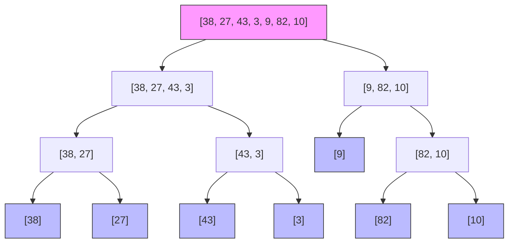

# 🔧 Sorting Techniques

> **Sorting** is the process of arranging elements in a particular order (ascending or descending).

Think of sorting like **organizing a deck of cards** 🃏. Shuffled cards are chaos — you can't find the 7 of hearts without scanning everything. But sort them, and *any card* becomes instantly findable.

> 🧠 **The big idea of this whole chapter:** the more organized your data, the faster you can use it. Sorting unlocks **binary search** (O(log n)), makes duplicates adjacent, and turns merging into a single pass.

We'll climb **three levels of sorting**:

- **Level 1 (Basic):** Selection, Bubble, Insertion — easy to *understand*, slow to *run*
- **Level 2 (Advanced):** Merge, Quick — fast, but clever (recursion + divide & conquer)
- **Level 3 (Special):** Cyclic, Counting, Radix — exploit special input to beat everything

---

# Part 1 — 📘 Why Bother Sorting?

| Without Sorting | With Sorting |
|-----------------|--------------|
| Search = **O(n)** (scan everything) | Search = **O(log n)** (binary search) |
| Duplicates scattered everywhere | Duplicates sit **side by side** |
| Merging two lists = messy | Merge sorted lists in **O(n)** |
| Median = complex math | Median = just the **middle element** |

> 💡 Sorting is the **key that unlocks** binary search — and binary search is one of the most powerful tools in programming.

---

# Part 2 — Level 1: The Three Classics (O(n²))

These three are the **training wheels** of sorting. They're slow, but their logic is the foundation everything else builds on.

## 🟢 Selection Sort

**Idea:** Select the minimum element and place it at the correct position.  
**Mantra:** *Select the minimum and swap.*

> 👑 **Analogy:** Imagine lining up students by height. You scan the whole line, pick the shortest person, and move them to seat 1. Then scan the *remaining* line, pick the next shortest, seat 2. And so on.

### The Algorithm

1. Find the minimum in the unsorted part.
2. Swap it with the first element of the unsorted part.
3. Repeat until the whole array is sorted.

### 🧪 Watch It Work — Sort `[29, 10, 14, 37, 13]`

```
Pass 1:  [29, 10, 14, 37, 13]
          ██  scan for min → 10  →  swap with 29
         [10, 29, 14, 37, 13]     ← 10 is now LOCKED ✅

Pass 2:  [10, 29, 14, 37, 13]
              ██  scan → min is 13 → swap with 29
         [10, 13, 14, 37, 29]     ← 13 LOCKED ✅

Pass 3:  [10, 13, 14, 37, 29]
                  ██  14 is already smallest → no swap
         [10, 13, 14, 37, 29]     ← 14 LOCKED ✅

Pass 4:  [10, 13, 14, 37, 29]
                      ██  min = 29 → swap with 37
         [10, 13, 14, 29, 37]     ← SORTED! ✅
```

> 🔑 **Notice the pattern:** each pass locks **one element into its final seat**. After `n-1` passes, everything is sorted.

### The Golden Rules of Selection Sort

| Rule | Why |
|------|-----|
| Runs for exactly **`n-1` passes** | The last element needs no selection |
| **Not stable** | Swapping equal elements can reorder them |
| Always **O(n²)** — even on sorted input | It never knows it's done; it always rescans |
| **In-place, O(1)** space | Only a `minIndex` variable needed |

**Complexity:** Best/Worst/Average **O(n²)** · Space **O(1)** · Stable ❌

[Refer Code](SelectionSort.java)

---

## 🟢 Bubble Sort

**Idea:** Repeatedly swap adjacent elements to "bubble" the largest element to the end.  
**Mantra:** *Push the maximum to the right.*

> 👑 **Analogy:** Bubbles in a glass of soda rise to the top. Each pass, the biggest element "bubbles up" to its final position at the end.

### The Algorithm

1. Compare adjacent pairs; swap if out of order.
2. After each pass, the largest element settles at the end.
3. Repeat until a pass makes **no swaps** → done!

### 🧪 Watch It Work — Sort `[5, 1, 4, 2, 8]`

```
Pass 1:  [5, 1, 4, 2, 8]
          [1, 5, 4, 2, 8]   ← swap 5↔1
          [1, 4, 5, 2, 8]   ← swap 5↔4
          [1, 4, 2, 5, 8]   ← swap 5↔2
          [1, 4, 2, 5, 8]   ← 5 < 8, no swap
          → 8 has bubbled to the end ✅

Pass 2:  [1, 4, 2, 5, 8]
          [1, 4, 2, 5, 8]   ← 1 < 4, no swap
          [1, 2, 4, 5, 8]   ← swap 4↔2
          [1, 2, 4, 5, 8]   ← 4 < 5, no swap
          → 5 in place ✅

Pass 3:  [1, 2, 4, 5, 8]
          [1, 2, 4, 5, 8]   ← NO swaps at all → ALREADY SORTED → STOP 🛑
```

### The Optimization (Crucial!)

Without a flag, Bubble Sort always runs all `n-1` passes — even on sorted data. With a `swapped` flag, it **bails early** when it detects the array is sorted:

```java
for (int i = 0; i < n - 1; i++) {
    boolean swapped = false;                     // 🚩 watch for swaps
    for (int j = 0; j < n - i - 1; j++) {
        if (arr[j] > arr[j + 1]) {
            swap(arr, j, j + 1);
            swapped = true;
        }
    }
    if (!swapped) break;   // ✅ no swaps → done early!
}
```

> 🔑 **The `swapped` flag turns Bubble's best case from O(n²) into O(n).** On sorted input it scans once, sees no swaps, and exits.

### The Golden Rules of Bubble Sort

| Rule | Why |
|------|-----|
| **`j < n - i - 1`** in the inner loop | The last `i` elements are already locked |
| **The `swapped` flag** | Detects sorted input → O(n) best case |
| **Stable** | Equal elements never swap across each other |
| Only good for **small/teaching** data | O(n²) falls apart on big arrays |

**Complexity:** Best **O(n)** · Worst/Average **O(n²)** · Space **O(1)** · Stable ✅

[Refer Code](BubbleSort.java)

---

## 🟢 Insertion Sort

**Idea:** Build the sorted array one element at a time, inserting each into its correct spot.  
**Mantra:** *Pick an element and place it where it belongs.*

> 👑 **Analogy:** Sorting a **hand of playing cards**. You hold `[5]` sorted. You draw `2`, scan left, shift the `5` right, and slip the `2` in front. Then draw `4`, shift the `5`, insert. The sorted part grows one card at a time.

### The Algorithm

1. Treat the first element as the "sorted hand."
2. Take the next element (the "drawn card").
3. Shift bigger elements right to make a gap.
4. Insert the drawn card into the gap.
5. Repeat for every element.

### 🧪 Watch It Work — Sort `[5, 2, 4, 6, 1, 3]`

```
Start:   [5] | 2  4  6  1  3       (5 is the "hand")
Step 1:  2 < 5 → shift 5 right → [2, 5 | 4, 6, 1, 3]
Step 2:  4 → shift 5 → insert →  [2, 4, 5 | 6, 1, 3]
Step 3:  6 → already in place →  [2, 4, 5, 6 | 1, 3]
Step 4:  1 → shift ALL →         [1, 2, 4, 5, 6 | 3]
Step 5:  3 → shift 4,5,6 →       [1, 2, 3, 4, 5, 6] ✅ SORTED!
```

> 🔑 **Notice the `|` wall** — everything left of it is sorted. The wall moves right one position per step until the whole array is on the sorted side.

### The Golden Rules of Insertion Sort

| Rule | Why |
|------|-----|
| **Best O(n) on nearly-sorted data** | Almost nothing to shift — the wall barely moves |
| **Stable** | We insert *after* equals → order preserved |
| **The real-world workhorse** | Java's own sort uses it for small arrays |
| **In-place** | Shifting happens inside the same array |

**Complexity:** Best **O(n)** · Worst/Average **O(n²)** · Space **O(1)** · Stable ✅

[Refer Code](InsertionSort.java)

---

## 📋 Level 1 — Who Wins?

| Sort | Best for | Stability | Verdict |
|------|----------|-----------|---------|
| **Selection** | Learning, tiny N | ❌ | Rarely used in practice |
| **Bubble** | Teaching concepts | ✅ | Simple, but inefficient |
| **Insertion** | Small/nearly-sorted data | ✅ | **Widely used in real code!** |

> 💡 Fun fact: all three are **O(n²)**, yet Insertion is the one you'll actually encounter in production — because real-world data is *often nearly sorted*.

---

# Part 3 — Level 2: Divide & Conquer (O(n log n))

These algorithms break the array into pieces, solve each piece, then combine — **recursively**. They climb from O(n²) to O(n log n).

## 🟢 Merge Sort

**Idea:** Divide the array into halves, sort each half recursively, then **merge** them.  
**Mantra:** *Divide and Merge.*

> 👑 **Analogy:** Two sorted piles of cards in front of you. To merge, you compare the **top** of each pile and take the smaller — one pass, done. Merge Sort just keeps dividing until every pile has one card (which is trivially sorted), then merges everything back up.

### The Algorithm

1. **Divide** the array in half until each subarray has one element.
2. **Conquer** — a single element is already sorted (base case!).
3. **Merge** the two sorted halves into one sorted array.

### 🧪 Watch It Work — The Full Divide Tree



### 🧪 Watch the Merge Step (the heart!)

The magic is in *combining* two sorted halves:

```
Merge [27, 38]  +  [3, 43]:

Compare tops:  27 vs 3  → take 3
Compare tops:  27 vs 43 → take 27
Compare tops:  38 vs 43 → take 38
One pile empty → take 43

Result: [3, 27, 38, 43] ✅
```

> 🔑 Merging two sorted arrays is **O(n)** — just keep taking the smaller top. That's why divide & conquer wins: you sort cheaply at the bottom, then merge cheaply all the way up.

### The Golden Rules of Merge Sort

| Rule | Why |
|------|-----|
| **Always O(n log n)** — even worst case | Dividing in half is unavoidable, regardless of input |
| **Needs O(n) extra space** | The merge step uses temporary arrays |
| **Stable** | Equal elements merge in original order |
| **Recursion base case: size 1** | A single element is trivially sorted |

**Complexity:** Best/Worst/Average **O(n log n)** · Space **O(n)** · Stable ✅

[Refer Code](MergeSort.java)

---

## 🟢 Quick Sort

**Idea:** Partition the array around a **pivot**, then recursively sort the partitions.  
**Mantra:** *Partition and Conquer.*

> 👑 **Analogy:** Pick a "captain" (the pivot). Everyone shorter goes to the left, everyone taller to the right. Now the captain is **permanently in their final seat** — no one will ever need to move them again! Repeat for the left and right groups.

### The Algorithm

1. Choose a **pivot**.
2. **Partition:** smaller elements → left, larger → right.
3. Recursively Quick-Sort the left and right partitions.
4. Base case: subarray size ≤ 1.

### 🧪 Watch It Work — Sort `[10, 80, 30, 90, 40, 50, 70]` (pivot = 70)

```
[10, 80, 30, 90, 40, 50, 70]
            ↓  partition around 70
[10, 30, 40, 50, 70, 90, 80]   ← 70 is now in its FINAL seat ✅
[10, 30, 40, 50]  [90, 80]     ← recurse on both sides
    ↓ pivot=50       ↓ pivot=80
[10, 30, 40, 50]   [80, 90]
    ↓ recurse ...
... until every subarray has ≤ 1 element → done
```

> 🔑 **The pivot trick:** once partitioned, the pivot *never moves again*. Each partition permanently fixes one element → done in ~log n levels.

### The Golden Rules of Quick Sort

| Rule | Why |
|------|-----|
| **In-place** — no extra arrays | Partition swaps inside the array (only recursion stack) |
| **Pivot choice is destiny** | First/last element as pivot on sorted input → **O(n²)**! |
| **Not stable** | Partition swaps scatter equal elements |
| **Best in practice** despite O(n²) worst case | Average is O(n log n) with tiny constant factors |

> 🚨 **The classic trap:** if you always pick the *first* element as pivot on an already-sorted array, each partition splits off just one element → `n` levels of recursion → O(n²). Random or median-of-three pivot avoids this.

**Complexity:** Best/Average **O(n log n)** · Worst **O(n²)** · Space **O(log n)** · Stable ❌

[Refer Code](QuickSort.java)

---

## 🟢 Recursive Bubble & Insertion (Same Idea, New Flavor)

These are the classic sorts rewritten **recursively** — the logic is identical, only the loop becomes a base case + self-call.

### Recursive Bubble Sort

```java
void recursiveBubbleSort(int[] arr, int n) {
    if (n <= 1) return;                    // base case: 1 element = sorted
    for (int i = 0; i < n - 1; i++) {
        if (arr[i] > arr[i + 1]) swap(arr, i, i + 1);
    }
    recursiveBubbleSort(arr, n - 1);      // one element locked per call
}
```

**Complexity:** Same as Bubble — **O(n²)**, but **O(n)** recursion depth (deeper than iterative!).

### Recursive Insertion Sort

```java
void recursiveInsertionSort(int[] arr, int n) {
    if (n <= 1) return;                    // base case
    recursiveInsertionSort(arr, n - 1);   // sort the first n-1 first
    int last = arr[n - 1];                // then insert the last element
    int j = n - 2;
    while (j >= 0 && arr[j] > last) {
        arr[j + 1] = arr[j];
        j--;
    }
    arr[j + 1] = last;
}
```

**Complexity:** Same as Insertion — **O(n²)**, **O(n)** recursion depth.

> 🔑 **Key takeaway:** recursion replaces the *outer loop* — each call handles one "pass." If you understand the iterative version, you understand these. (Remember the recursion notes? *Base case + progress toward it*!)

[Refer Code](RecursiveBubbleSort.java) · [Refer Code](RecursiveInsertionSort.java)

---

# Part 4 — Level 3: Special Sorts (Beating O(n log n))

These three **break the rules** — they don't compare elements at all. Instead, they exploit the *input itself*.

## 🟢 Cyclic Sort

**Idea:** Place each element directly at its correct index (`value → index = value - 1`).  
**Mantra:** *Put every number where it belongs.*

> 👑 **Analogy:** Imagine 5 numbered lockers and 5 students holding numbers 1–5. Just walk to locker `yourNumber - 1` and sit. If the seat is taken, the occupant swaps with you and walks to *their* seat.

### The Algorithm

1. Start at index 0.
2. Is `arr[i]` in its home (`arr[i] == i + 1`)?
3. **No** → swap it with the element at index `arr[i] - 1`.
4. **Yes** → move to the next index.

### 🧪 Watch It Work — Sort `[3, 1, 5, 4, 2]`

```
[3, 1, 5, 4, 2]   i=0: 3 should be at index 2 → swap with 5
[5, 1, 3, 4, 2]   i=0: 5 should be at index 4 → swap with 2
[2, 1, 3, 4, 5]   i=0: 2 should be at index 1 → swap with 1
[1, 2, 3, 4, 5]   i=0: 1 is home ✅ → move to i=1
[1, 2, 3, 4, 5]   ... everything else already home → SORTED ✅
```

> 🔑 **The magic:** each element is swapped **at most once** → O(n)! That's why Cyclic beats every comparison sort.

### When Does It Work?

- ✅ Elements are in range **1…N** (N = array size)
- ✅ Perfect for **missing number / duplicate / find-all-missing** problems
- ❌ Useless for arbitrary, negative, or non-integer values

**Complexity:** Time **O(n)** · Space **O(1)** · Stable ❌

[Refer Code](CyclicSort.java)

---

## 🟢 Counting Sort

**Idea:** Count how many times each value appears, then rebuild the sorted array.  
**Mantra:** *Count frequencies, then place elements.*

> 👑 **Analogy:** Tally votes! Instead of comparing numbers, you just **count** how many of each value exist, then write them out in order.

### 🧪 Watch It Work — Sort `[4, 2, 2, 8, 3, 3, 1]`

```
Step 1: largest = 8 → make a count array of size 9

Step 2: count each value:
        value: 0 1 2 3 4 5 6 7 8
        count: 0 1 2 2 1 0 0 0 1

Step 3: prefix sums (cumulative — enables stability):
        cum:   0 1 3 5 6 6 6 6 7

Step 4: place right-to-left using cum → stable!
        Result: [1, 2, 2, 3, 3, 4, 8] ✅
```

### The Golden Rules of Counting Sort

| Rule | Why |
|------|-----|
| **Non-comparison** — beats O(n log n)! | Counting is O(1) per element, no comparisons |
| Best when **range k ≈ n** | If `k` is huge, the count array wastes memory |
| **Stable** (with prefix sums) | Essential — Radix Sort *depends* on this |
| Negative numbers need an **offset** | Shift all values up before counting |

**Complexity:** Time **O(n + k)** · Space **O(n + k)** · Stable ✅

[Refer Code](CountSort.java)

---

## 🟢 Radix Sort

**Idea:** Sort digit by digit, from **least significant** to most, using a **stable** sort (Counting Sort) each round.  
**Mantra:** *Sort by digits, preserve order.*

> 👑 **Analogy:** Sorting library cards by a 3-digit code: first by the last digit, then the middle, then the first. If each round is *stable*, the previous digit's order survives.

### 🧪 Watch It Work — Sort `[170, 45, 75, 90, 802, 24, 2, 66]`

```
Ones digit:   [170, 90, 802, 2, 24, 45, 75, 66]   ← sort by last digit
Tens digit:   [802, 2, 24, 45, 66, 170, 75, 90]   ← stable, sort by tens
Hundreds:     [2, 24, 45, 66, 75, 90, 170, 802]   ✅ SORTED!
```

> 🔑 **Why stability matters:** when sorting by the *tens* digit, two numbers with the same tens (like 24 and 2) keep their *ones-digit* order from the previous round. Stability is what makes digit-by-digit work.

**Pseudocode:**

```
radixSort(arr) {
    max = getMax(arr);
    for (int exp = 1; max / exp > 0; exp *= 10) {
        countingSortByDigit(arr, exp);   // stable sort by current digit
    }
}
```

**Complexity:** Time **O(n · k)** · Space **O(n + k)** · Stable ✅

---

# 📊 Master Comparison Table

| Algorithm | Best | Average | Worst | Space | Stable | In-place | Type |
|-----------|------|---------|-------|-------|--------|----------|------|
| Selection | O(n²) | O(n²) | O(n²) | O(1) | ❌ | ✅ | Comparison |
| Bubble | O(n) | O(n²) | O(n²) | O(1) | ✅ | ✅ | Comparison |
| Insertion | O(n) | O(n²) | O(n²) | O(1) | ✅ | ✅ | Comparison |
| Merge | O(n log n) | O(n log n) | O(n log n) | O(n) | ✅ | ❌ | D&C |
| Quick | O(n log n) | O(n log n) | O(n²) | O(log n) | ❌ | ✅ | D&C |
| Cyclic | O(n) | O(n) | O(n) | O(1) | ❌ | ✅ | Special |
| Counting | O(n+k) | O(n+k) | O(n+k) | O(n+k) | ✅ | ❌ | Non-compare |
| Radix | O(n·k) | O(n·k) | O(n·k) | O(n+k) | ✅ | ❌ | Non-compare |

---

# 📌 When to Use Which Sort?

| Scenario | Reach for |
|----------|-----------|
| Small array / nearly sorted | **Insertion Sort** |
| Large array, guaranteed O(n log n) | **Merge Sort** |
| Large array, memory-constrained | **Quick Sort** |
| Integers 1…N (missing/duplicate problems) | **Cyclic Sort** |
| Small integer range (0…k) | **Counting Sort** |
| Fixed-length integers / strings (IDs, phone numbers) | **Radix Sort** |
| Just learning / teaching | **Bubble / Selection Sort** |

---

# ⚠️ Common Mistakes

1. **Bubble's inner loop** — `j < n - i - 1`, not `j < n - 1`. Going too far walks off the locked region.

```java
for (int j = 0; j < n - i - 1; j++)   // ✅ correct
for (int j = 0; j < n - 1; j++)       // ❌ repeats work every pass
```

2. **Quick Sort's pivot choice** — always picking first/last element on sorted input → O(n²).

3. **Merge Sort without the merge** — dividing alone does nothing! The merge step is where the sorting happens.

4. **Using an unstable sort when order of equals matters** — e.g., sorting students by *grade*, then by *name*: the second sort must be stable or the first sort's work is lost.

5. **Cyclic Sort on the wrong range** — only works for values in **1…N**. Arbitrary or negative numbers break it.

6. **Counting Sort on a huge range** — if `k >> n`, the count array wastes memory. Use a comparison sort instead.

7. **Forgetting `Arrays.sort()` exists** — for everyday Java, the built-in sort (a tuned dual-pivot Quick Sort) beats anything you'll hand-roll. Use these algorithms to *learn*, use `Arrays.sort` to *ship*.

---

# 🧠 Practice: Think by Hand

**Exercise 1 — Trace Selection Sort** on `[64, 25, 12, 22, 11]`. Write down each pass and which element gets locked.

**Exercise 2 — Spot the bug.** What's wrong here?

```java
for (int i = 0; i < n - 1; i++) {
    int min = i;
    for (int j = i + 1; j < n; j++) {
        if (arr[j] < arr[min]) min = j;
    }
    // oops — forgot the swap!
}
```

**Exercise 3 — Design it.** Merge `[3, 27, 38, 43]` and `[9, 10, 82]` by hand using the "compare tops" rule. How many comparisons?

**Exercise 4 — Predict it.** You run Merge Sort on an array that's *already sorted*. Does it run faster, slower, or the same? (Hint: the divide is unavoidable.)

---

# 📝 Quick Revision Cheatsheet

* **Selection:** pick min, swap to front — O(n²), unstable, always n-1 passes
* **Bubble:** swap adjacent, max bubbles right — O(n²), O(n) best, stable
* **Insertion:** insert into sorted prefix — O(n²), O(n) best, stable, best for small data
* **Merge:** divide, sort, merge — O(n log n) *always*, stable, needs O(n) space
* **Quick:** partition by pivot, recurse — O(n log n) avg, O(n²) worst, in-place, unstable
* **Cyclic:** value → index (value-1) — O(n), only for 1…N ranges
* **Counting:** frequency → place — O(n+k), stable, small range
* **Radix:** stable sort digit by digit — O(n·k), stable, fixed-length keys

---

# 🎯 Key Takeaways

1. **Stable** = equal elements keep their order — critical when sorting by multiple keys
2. **In-place** = no extra array — memory-efficient but often unstable
3. **Divide & conquer** (Merge/Quick) leap from O(n²) to O(n log n)
4. **Quick Sort** is the fastest in practice — but only if the **pivot** behaves
5. **Special sorts** (Cyclic/Counting/Radix) exploit input to beat even O(n log n)
6. **Real-world rule:** know the data, then choose — size, range, and stability all matter
7. **`Arrays.sort()`** exists for a reason — these notes are for *understanding*, Java does the rest

> *"Sorting is the art of turning chaos into order — one comparison at a time."* 🃏😄