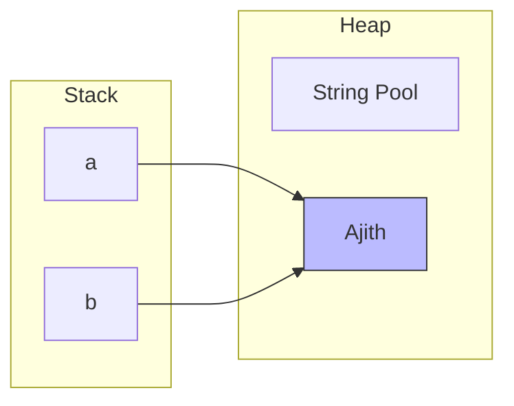
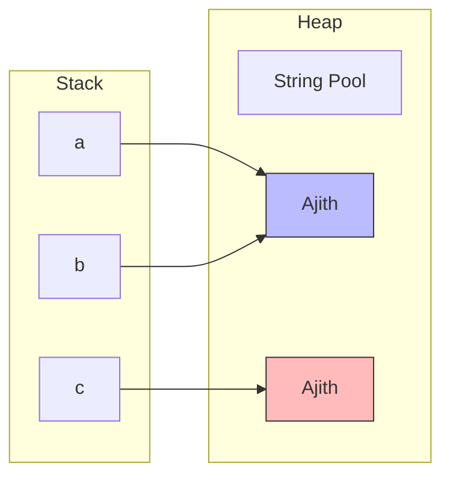
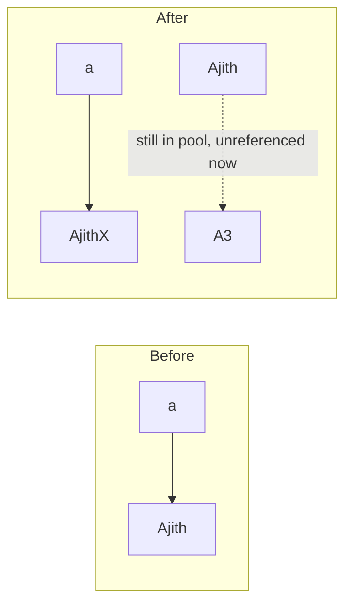
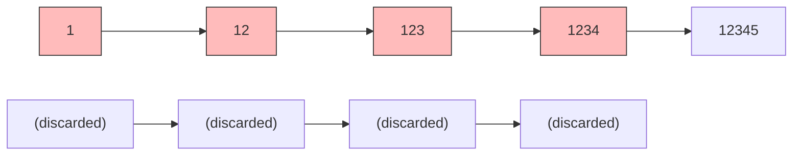

# 🔤 Strings in Java

> A **String** in Java is an **immutable** datatype — once created, its value **cannot be changed**.  
> It represents a **collection of characters**.

Think of a String like a **printed newspaper** 📰 — you can read it, but you can't edit it. To change anything, you need a fresh copy.

---

## 📘 String Creation

**General Syntax:**
```
datatype ref_variable = object
```

**Example:**
```java
String a = "Ajith";
String b = "Ajith";
```

### Visual: Memory Layout



> 💡 Both `a` and `b` point to the **same object** `"Ajith"` in the **String Pool**.

---

## 📘 The String Pool — Where Strings Live

The **String Pool** is a special memory area **inside the heap** where Java caches string literals.

### How it works:

1. When you write `"Ajith"`, Java checks the pool.
2. **Exists?** → Reuses the existing object (no new allocation).
3. **Doesn't exist?** → Creates a new object and stores it in the pool.

```java
String a = "Ajith";   // pool check → not there → create + store
String b = "Ajith";   // pool check → FOUND → reuse (same object as a)
```

**Result:** `a == b` is `true` (same reference!)

---

### 🔴 Forcing a New Object: `new String(...)`

```java
String c = new String("Ajith");   // Creates a NEW object in heap (NOT pool)
```



**Result:**
- `a == b` → `true` (same pool object)
- `a == c` → `false` (different objects!)
- `a.equals(c)` → `true` (same value)

> ⚠️ **Memory Tip:** `new String("...")` creates a duplicate that bypasses the pool → wastes memory. Avoid unless you truly need a fresh object.

---

## 📘 Immutability — Why Strings Can't Change

Once a String object is created, its value is **final**. Any "modification" creates a **brand new object**.

```java
String a = "Ajith";
a = a + "X";   // Does NOT modify "Ajith"
               // Creates a new "AjithX" object and points a to it
```



### Why Immutable? — Benefits ✅

| Benefit | Explanation |
|---------|-------------|
| **Thread-safe** | Multiple threads can share a String without synchronization |
| **Security** | Safe for sensitive data (passwords, URLs) — can't be tampered |
| **Caching** | Hashcodes cached → fast for HashMap keys |
| **String Pool** | Same literal can be shared safely (no accidental mutation) |
| **Class loading** | Class names are Strings — must be stable |

---

## 📘 String Comparison — The Classic Trap

### `==` → Compares **References** (memory addresses)
### `.equals()` → Compares **Values** (actual content)

```java
String a = "Ajith";
String b = "Ajith";
String c = new String("Ajith");

a == b      // true   — same pool object
a == c      // false  — different heap objects
a.equals(c) // true   — same characters
```

> 🚨 **Golden Rule:** **ALWAYS use `.equals()`** for String content comparison.  
> `==` only works by luck (pool reuse) — and breaks the moment `new` is involved.

---

## 📘 Common String Operations

### Char + Char = Number!

```java
'a' + 'b'   // 195   → adds ASCII values (97 + 98)
```

### String + String = Concatenation

```java
"a" + "b"   // "ab"  → joins strings
```

### Char + Number (Casting)

```java
(char)('a' + 3)  // 'd'   → ASCII math then cast back to char
```

### String + int = String

```java
"a" + 1     // "a1"  → number auto-converts to string
```

### Quick Reference Table

| Expression | Result | Why |
|------------|--------|-----|
| `'a' + 'b'` | `195` | Both chars → **ASCII addition** |
| `"a" + "b"` | `"ab"` | Both strings → **concatenation** |
| `'a' + 1` | `98` | Char + int → **numeric addition** |
| `"a" + 1` | `"a1"` | String + int → **concatenation** |
| `(char)('a' + 3)` | `'d'` | Explicit cast → **back to char** |

> 💡 **Rule:** If **either** operand is a String → concatenation. If **both** are primitives → math.

---

## 📘 String Performance — The Hidden Cost

### Every Concatenation Creates a New Object

```java
String s = "";
for (int i = 1; i <= 5; i++) {
    s = s + i;   // Creates a NEW object each time!
}
```

**Trace:**
```
"" + 1  → "1"       (copy 1 char)
"1" + 2 → "12"      (copy 2 chars)
"12" + 3 → "123"    (copy 3 chars)
"123" + 4 → "1234"  (copy 4 chars)
"1234" + 5 → "12345" (copy 5 chars)
```

**Total work:** `1 + 2 + 3 + 4 + 5 = 15` operations  
**For N concatenations:** `1 + 2 + ... + N = N(N+1)/2` ≈ **O(N²)**

### Visual: The Waste



Every intermediate string is created, copied, then **abandoned** → O(N²) time + lots of garbage.

---

## 📘 StringBuilder — The Efficient Alternative

**StringBuilder** is a **mutable** String — it modifies its own internal buffer **without creating new objects**.

```java
StringBuilder sb = new StringBuilder();
for (int i = 1; i <= 5; i++) {
    sb.append(i);   // Modifies the SAME buffer
}
String result = sb.toString();   // Convert to String at the end
```

**Same object, growing buffer:**
```
[1]
[1, 2]
[1, 2, 3]
[1, 2, 3, 4]
[1, 2, 3, 4, 5]
```

| Aspect | String | StringBuilder |
|--------|--------|---------------|
| Mutable? | ❌ No | ✅ Yes |
| Append cost | O(N) each (copy) | **O(1)** amortized |
| N appends total | O(N²) | **O(N)** |
| Thread-safe? | ✅ Yes | ❌ No |
| Best for | Fixed/static text | Heavy manipulation, loops |

> 💡 **When resizing:** StringBuilder's internal array doubles when full → amortized O(1) per append.

---

## 📘 StringBuffer — Thread-Safe StringBuilder

**StringBuffer** = **StringBuilder** + **synchronized methods**.

```java
StringBuffer sb = new StringBuffer();
sb.append("Hello");   // synchronized — safe across threads
```

### String vs StringBuilder vs StringBuffer

| Feature | String | StringBuilder | StringBuffer |
|---------|--------|---------------|--------------|
| **Mutable** | ❌ | ✅ | ✅ |
| **Thread-safe** | ✅ (immutable) | ❌ | ✅ (synchronized) |
| **Speed** | Slow for changes | ⚡ Fastest | Slower (sync overhead) |
| **Used when** | Static text, keys | Single thread, heavy editing | Multi-thread, shared editing |
| **Memory** | Pool / new copies | Same buffer | Same buffer |

---

## 📘 Common String Methods Cheatsheet

```java
String s = "Hello World";

s.length();                 // 11
s.charAt(0);                // 'H'
s.substring(0, 5);          // "Hello"
s.indexOf('o');             // 4
s.lastIndexOf('o');         // 7
s.toUpperCase();            // "HELLO WORLD"
s.toLowerCase();            // "hello world"
s.replace('l', 'L');        // "HeLLo WorLD"
s.contains("World");        // true
s.startsWith("He");         // true
s.endsWith("ld");           // true
s.split(" ");               // ["Hello", "World"]
s.trim();                   // removes leading/trailing spaces
s.isEmpty();                // false
s.equals("hello world");    // false (case-sensitive)
s.equalsIgnoreCase("hello world");  // true
s.compareTo("Hello");       // lexicographic comparison (int)
```

---

## 📘 Common Mistakes ⚠️

### 1. Using `==` Instead of `.equals()`

```java
// ❌ WRONG — compares references
if (a == b) { ... }

// ✅ CORRECT — compares values
if (a.equals(b)) { ... }
```

### 2. O(N²) Concatenation in a Loop

```java
// ❌ SLOW — creates N new objects
String result = "";
for (int i = 0; i < 100000; i++) {
    result += i;   // O(N²) total
}

// ✅ FAST — single buffer
StringBuilder sb = new StringBuilder();
for (int i = 0; i < 100000; i++) {
    sb.append(i);  // O(N) total
}
```

### 3. Confusing `length` vs `length()`

```java
String s = "Hello";
s.length;   // ❌ COMPILE ERROR — String uses length() method
s.length(); // ✅ method call

int[] arr = {1, 2, 3};
arr.length;  // ✅ field (no parentheses)
arr.length(); // ❌ COMPILE ERROR
```

### 4. Forgetting That Strings Are Immutable

```java
// ❌ WRONG — this does nothing!
s.replace("a", "b");
System.out.println(s);  // still "aaa"!

// ✅ CORRECT — capture the result
s = s.replace("a", "b");
System.out.println(s);  // "bbb"
```

### 5. Substring Off-by-One Errors

```java
String s = "Hello";
s.substring(0, 5);   // "Hello" (index 5 is exclusive)
s.substring(1, 3);   // "el" (NOT "ell")
```

### 6. Mutating the Source When You Meant a Copy

```java
// Passing strings around is safe (immutable)
String original = "Hello";
String copy = original;          // same reference, but SAFE
copy = copy.toUpperCase();       // original is untouched
System.out.println(original);    // "Hello" ✅
```

---

## 📘 Common String Problems & Approaches

| Problem Type | Approach | Example |
|--------------|----------|---------|
| **Palindrome check** | Two pointers from ends | `"madam"` → true |
| **Anagram check** | Count frequency with array of 26 | `"listen"`/`"silent"` |
| **Longest substring without repeats** | Sliding window + HashSet | `"abcabcbb"` → 3 |
| **Reverse words** | Split + reverse + join | `"Hello World"` → `"World Hello"` |
| **String to int (atoi)** | Iterate + accumulate, handle signs | `" -42"` → -42 |
| **Most frequent char** | Frequency array + max | `"aabbbc"` → `'b'` |
| **First non-repeating char** | Frequency array + first pass | `"leetcode"` → `'l'` |
| **Longest common prefix** | Compare char by char | `["flower","flow","flight"]` → `"fl"` |

---

## 📌 String vs StringBuilder — When to Use Which?

| Scenario | Use |
|----------|-----|
| Fixed/constant text | **String** |
| Comparing content | **String** (with `.equals()`) |
| HashMap keys | **String** (immutable → safe) |
| Heavy concatenation in loops | **StringBuilder** |
| Single-threaded text building | **StringBuilder** |
| Multi-threaded shared editing | **StringBuffer** |
| Temporary intermediate values | **StringBuilder** → `.toString()` |

---

## 📝 Quick Revision Cheatsheet

* **String** = immutable collection of characters
* **String Pool** = heap cache for string literals (reuse, no duplicates)
* `new String(...)` = bypasses pool (creates duplicate)
* `==` compares **references**, `.equals()` compares **values**
* `'a' + 'b'` = **ASCII math** (195); `"a" + "b"` = **concatenation**
* Each concatenation = new object → **O(N²)** in loops
* **StringBuilder** = mutable, **O(1)** append, not thread-safe
* **StringBuffer** = mutable, thread-safe, slower (synchronized)
* `.length()` for Strings, `.length` for arrays
* Always capture the return value of String operations!

---

## 🎯 Key Takeaways

1. **Strings are immutable** — every "change" creates a new object
2. **String Pool** shares literals — use it, don't bypass it
3. **`.equals()` not `==`** — always for content
4. **Char math ≠ String math** — one adds numbers, the other joins
5. **Loops + `+=` = O(N²)** — reach for `StringBuilder`
6. **StringBuilder** for single-thread, **StringBuffer** for multi-thread
7. **Read-only? Use String. Need to build? Use StringBuilder.**
